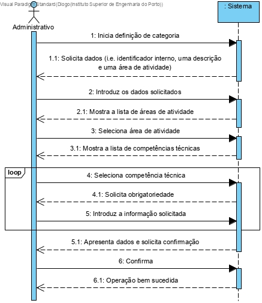
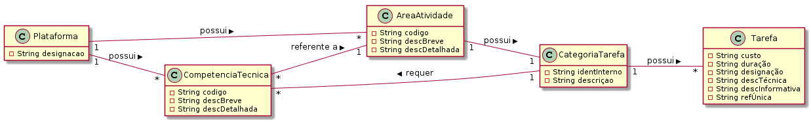
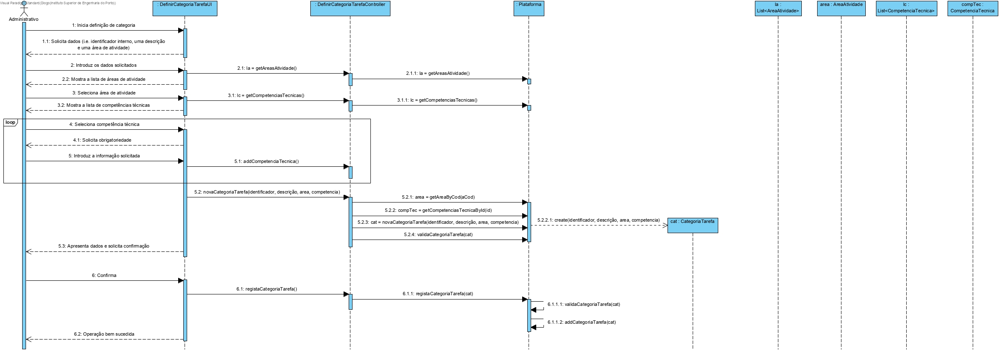
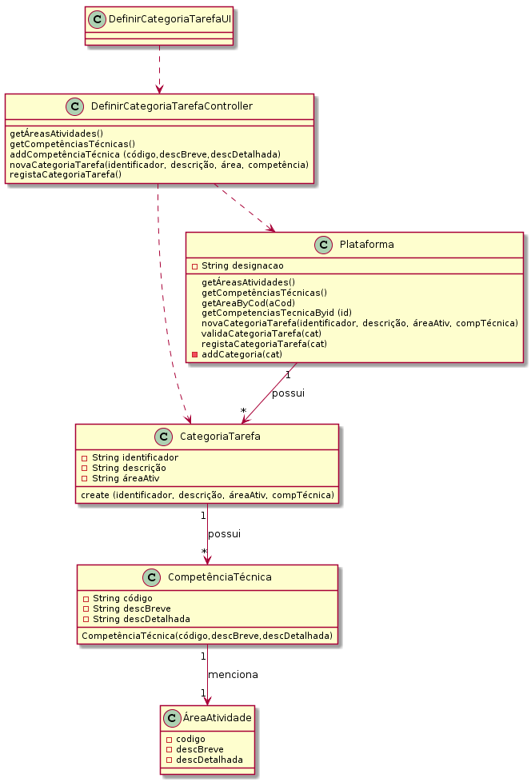

# UC3 - Definir Categoria (de Tarefa)

## Formato Breve

O administrativo inicia a definição de uma nova categoria. O sistema solicita os dados necessários (i.e. identificador interno (automático) e uma descrição). O administrativo introduz os dados solicitados. O sistema mostra a lista das áreas de atividade. O administrativo seleciona a área de atividade. O sistema mostra a lista de competência técnicas. O administrativo seleciona a competência Técnica. O sistema solicita a obrigatoriedade. O administrativo introduz a informação solicitada. O sistema valida e apresenta os dados ao administrativo, pedindo que os confirme. O administrativo confirma. O sistema regista os dados e informa o administrativo do sucesso da operação.

## SSD

## Formato Completo

### Ator principal

Administrativo

### Partes interessadas e seus interesses
* **Administrativo:** pretende definir as categorias de tarefas para que possa posteriormente catalogar as diversas tarefas.
* **T4J:** pretende que a plataforma permita ter as categorias, de forma organizada, das tarefas existentes.

### Pré-condições
n/a

### Pós-condições
A informação da categoria é registada no sistema.

## Cenário de sucesso principal (ou fluxo básico)

1. O administrativo inicia a definição de uma nova categoria. 
2. O sistema solicita os dados necessários (i.e. identificador interno (automático) e uma descrição).
3. O administrativo introduz os dados solicitados. 
4. O sistema mostra a lista das áreas de atividade.
5. O administrativo seleciona a área de atividade.
6. O sistema mostra a lista de competência técnicas.
7. O administrativo seleciona a competência Técnica.
8. O sistema solicita a obrigatoriedade.
9. O administrativo introduz a informação solicitada.
10. Os passos 7 a 9 repetem-se enquanto não forem introduzidas todas as competências técnicas pretendidas (minimo 1).
11. O sistema valida e apresenta os dados, pedindo que os confirme.
12. O administrativo confirma. 
13. O sistema regista os dados e informa o administrativo do sucesso da operação.

### Extensões (ou fluxos alternativos)

*a. O administrativo solicita o cancelamento da definição de categoria.

> O caso de uso termina.

4a. Dados mínimos obrigatórios em falta.
>	1. O sistema informa quais os dados em falta.
>	2. O sistema permite a introdução dos dados em falta (passo 3)
>
	>	2a. O administrativo não altera os dados. O caso de uso termina.

4b. O sistema deteta que os dados (ou algum subconjunto dos dados) introduzidos devem ser únicos e que já existem no sistema.
>	1. O sistema alerta o administrativo para o facto.
>	2. O sistema permite a sua alteração (passo 3)
>
	>	2a. O administrativo não altera os dados. O caso de uso termina.

4c. O sistema detecta que os dados introduzidos (ou algum subconjunto dos dados) são inválidos.
> 1. O sistema alerta o administrativo para o facto. 
> 2. O sistema permite a sua alteração (passo 3).
> 
	> 2a. O administrativo não altera os dados. O caso de uso termina. 

### Requisitos especiais
\-

### Lista de Variações de Tecnologias e Dados
\-

### Frequência de Ocorrência
\-

### Questões em aberto

* Existem outros dados que são necessários?
* Quais são os dados obrigatórios para a definição de uma categoria?
* Existe algum tipo de segurança específico para a verificação e segurança dos dados inseridos?
* Quais os dados que em conjunto permitem detectar a duplicação de categorias?
* Qual a frequência de ocorrência deste caso de uso?

## 2. Análise OO

### Excerto do Modelo de Domínio Relevante para o UC

## 3. Design - Realização do Caso de Uso

### Racional

| Fluxo Principal                                                                                        | Questão: Que Classe...                                      | Resposta                                       | Justificação                                                                                                         |
|:-------------------------------------------------------------------------------------------------------|:------------------------------------------------------------|:-----------------------------------------------|:---------------------------------------------------------------------------------------------------------------------|
|1. O administrativo inicia a definição de uma nova categoria. |... interage com o utilizador?|DefinirCategoriaUI|Pure Fabrication, pois não se justifica atribuir esta responsabilidade a nenhuma classe existe no Modelo de Domínio. |
||...coordena o UC?|DefinirCategoriaController|Controller|
||...cria/instancia Categoria?|Plataforma| Creator (Regra 1) |
|2. O sistema solicita os dados necessários (i.e. identificador interno (automático) e uma descrição).| | | |
|3. O administrativo introduz os dados solicitados. | ... guarda os dados introduzidos?|Categoria|Information Expert (IE) - instância criada no passo 1|
|4. O sistema mostra a lista das áreas de atividade.| ... tem conhecimento sobre as áreas de atividade existentes? | Plataforma |  Information Expert (IE) - A Plataforma contém/agrega AreaAtividade|
|5. O administrativo seleciona a área de atividade. | ...guarda a AreaAtividade? | CompetenciaTecnica | IE: CompetenciaTecnica catalogado numa AreaAtividade - instância criada no passo 1
|6. O sistema mostra a lista de competência técnicas. | ... tem conhecimento sobre as competências técnicas existentes? | Plataforma |  Information Expert (IE) - A Plataforma contém/agrega CompetênciaTécnica|
|7. O administrativo seleciona uma competência técnica.|...guarda a Competência Técnica? | CategoriaTarefa | IE: CompetênciaTécnica catalogada numa CategoriaTarefa - instância criada no passo 1
|8. O sistema solicita a obrigatoriedade.
|9. O administrativo introduz a informação solicitada.
|10. Os passos 7 a 9 repetem-se enquanto não forem introduzidas todas as competências técnicas pretendidas (minimo 1).||||
|11. O sistema valida e apresenta os dados, pedindo que os confirme.|...valida os dados do Administrativo (validação local)?|Categoria|E: Definir Categoria possui os seus próprios dados|
||...valida os dados do Administrativo (validação global)?|Plataforma|IE: A Plataforma contém/agrega categorias|
|12. O administrativo confirma.  ||||
|13. O sistema regista os dados e informa o administrativo do sucesso da operação.|...guarda a categoria registada?|Plataforma|IE. No MD a Plataforma contém/agrega Definir Categoria|
|| ... notifica o utilizador?  | DefinirCategoriaUI | |  

## Sistematização ##

 Do racional resulta que as classes conceptuais promovidas a classes de software são:

 * Plataforma
 * Competência Técnica
 * Categoria Tarefa
 * Area Atividade

Outras classes de software (i.e. Pure Fabrication) identificadas:  

 * DefinirCategoriaUI  
 * DefinirCategoriaController

###	Diagrama de Sequência

## Diagrama de Classes ##

