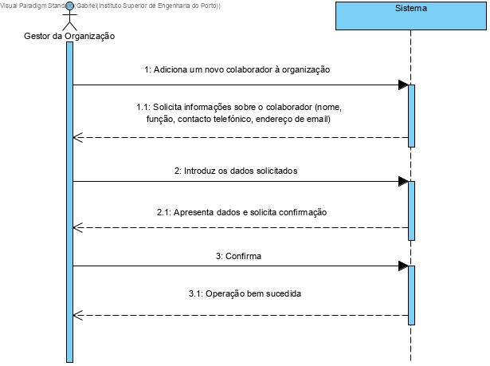
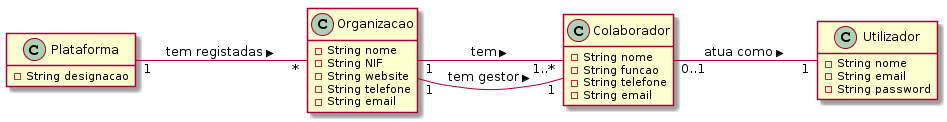
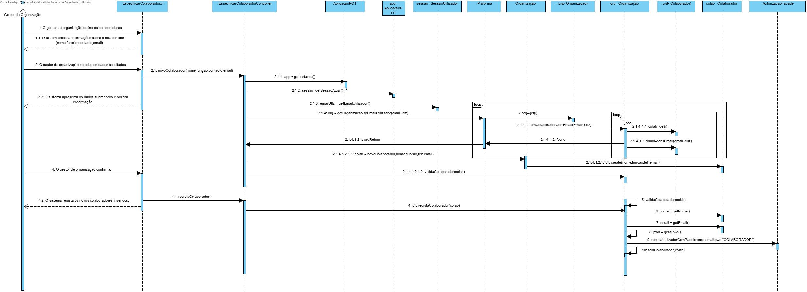
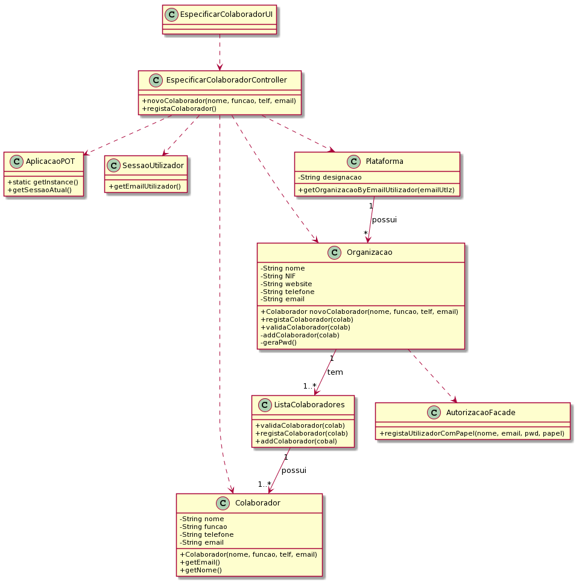

# UC5 - Especificar Colaborador de Organização

## 1. Engenharia de Requisitos

### Formato Breve

O Gestor de Organização, após o registo na organização na plataforma, especifica os colaboradores da respetica organização. É responsável por inserir os seus dados (nome, função, contacto telefónico, endereço de email) e os confirmar. O sistema regista os dados do colaborador, gera a sua password, torna-o um utilizador registado,enviando para o sei email a senha de acesso. Informa o gestor de organização do sucesso da operação.

### SSD

### Formato Completo

#### Ator principal

Gestor de Organização

#### Partes interessadas e seus interesses
* **Freelancers:** pretende que o colaborador designe as tarefas da empresa, para se propor à sua realização.
* **T4J:** pretende que a organização em causa incluia colaboradores, de modo a ser utilizada.
* **Gestor de Organização:** pretende especificar os colaboradores da sua organização. 
* **Organização:** pretende que os seus colaboradores esteja registados para que estes possam atuar em sua representação.

#### Pré-condições
Registo da empresa na aplicação

#### Pós-condições
A informação do novo colaborador de organização é registada no sistema.
O colaborador também se torna um utilizador registado sistema.

### Cenário de sucesso principal (ou fluxo básico)

1. O gestor de organização define os colaboradores.
2. O sistema solicita informações sobre o colaborador (nome, função, contacto telefónico, endereço de email).
3. O gestor de organização introduz os dados solicitados.
4. O sistema apresenta os dados submetidos e solicita confirmação.
5. O gestor de organização confirma.
6. O sistema regista os dados do colaborador, gera a sua password, torna-o um utilizador registado e informa o gestor de organização do sucesso da operação.

#### Extensões (ou fluxos alternativos)

*a. O gestor de organização solicita o cancelamento da nova tarefa.

> O caso de uso termina.

4a. Informações obrigatórios em falta.
>	1. O sistema informa quais estão em falta.
>	2. O sistema permite a introdução das informações em falta (passo 2)
>
	>	2a. O gestor de organização não altera os dados. O caso de uso termina.

4b. O sistema deteta que os dados informativos (ou algum subconjunto dos dados) introduzidos devem ser únicos e que já existem no sistema.
>	1. O sistema alerta o gestor de organização para o facto.
>	2. O sistema permite a sua alteração (passo 2)
>
	>	2a. O gestor de organização não altera os dados. O caso de uso termina.

4c. O sistema detecta que os dados informativos (ou algum subconjunto dos dados) são inválidos.
> 1. O sistema alerta o gestor de organização para o facto.
> 2. O sistema permite a sua alteração (passo 2).
>
	> 2a. O gestor de organização não altera os dados. O caso de uso termina.

#### Requisitos especiais
\-

#### Lista de Variações de Tecnologias e Dados
\-

#### Frequência de Ocorrência
\-

#### Questões em aberto

* Qual a frequência de ocorrência deste caso de uso?
* O gestor de organização precisa de preencher todas as informações necessárias?
* A tarefa também poderá vir a ser publicada pelo colaborador?
* É necessário perguntar se deseja adicionar mais colaboradores?

## 2. Análise OO

### Excerto do Modelo de Domínio Relevante para o UC

## 3. Design - Realização do Caso de Uso

### Racional

| Fluxo Principal | Questão: Que Classe... | Resposta  | Justificação  |
|:--------------  |:---------------------- |:----------|:---------------------------- |
| 1. O gestor de organização inicia a especificação de um colaborador da sua organização.   		 |	... interage com o utilizador? | EspecificarColaboradorUI    |  Pure Fabrication: não se justifica atribuir esta responsabilidade a nenhuma classe existente no Modelo de Domínio. |
|  		 |	... coordena o UC?	| EspecificarColaboradorController | Controller    |
|  		 |	... cria instância de Colaborador?| ListaColaboradores| HC/LC   |
||...conhece o utilizador/gestor a usar o sistema?|SessaoUtilizador|IE: cf. documentação do componente de gestão de utilizadores.|
||...sabe a que organização o utilizador/gestor pertence?|Plataforma|IE: conhece todas as organizações.|
|||Organização|IE: conhece o seu gestor/colaborador.|
|||Colaborador|IE: conhece os seus dados (e.g. email). |
| 2. O sistema solicita os dados necessários (i.e. nome, função, contacto telefónico, endereço de email).  		 |							 |             |                              |
| 3. O gestor de organização introduz os dados solicitados.  		 |	... guarda os dados introduzidos?  |   Colaborador | Information Expert (IE) - instância criada no passo 1: possui os seus próprios dados.     |
| 4. O sistema valida e apresenta os dados ao gestor de organização, pedindo que os confirme.   		 |	... valida os dados do Colaborador (validação local) | Colaborador |      IE: possui os seus próprios dados.|  	
|	 |	... valida os dados do Colaborador (validação global) | ListaColaboradores| HC/LC  |
| 5. O gestor de organização confirma os dados.   		 |							 |             |                              |
| 6. O sistema regista os dados do colaborador, gera a sua password, torna-o um utilizador registado e informa o gestor de organização do sucesso da operação.  		 |	... guarda o Colaborador criado? | Organizacao  | IE: a Organizacao contém/agrega Colaborador.|  
||... gera a password automática?|Plataforma |IE: é a Plataforma que está a proceder ao registo do colaborador, recorrendo a um serviço externo.|
|	| ... guarda o Utilizador referente ao Colaborador? | AutorizacaoFacade  | |

### Sistematização ##

 Do racional resulta que as classes conceptuais promovidas a classes de software são:

 * Plataforma
 * Colaborador

Outras classes de software (i.e. Pure Fabrication) identificadas:  

 * RegistarOrganizacaoUI  
 * RegistarOrganizacaoController

###	Diagrama de Sequência

###	Diagrama de Classes

