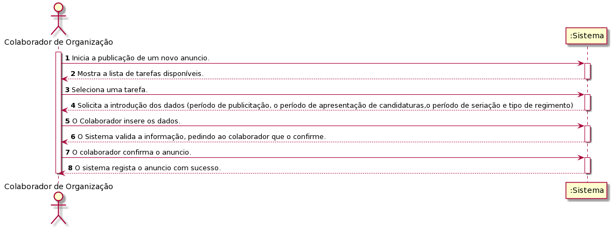
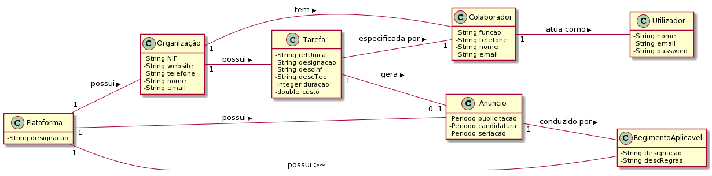
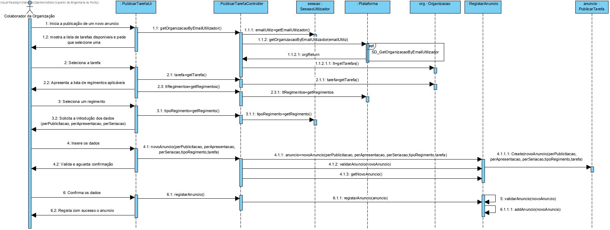
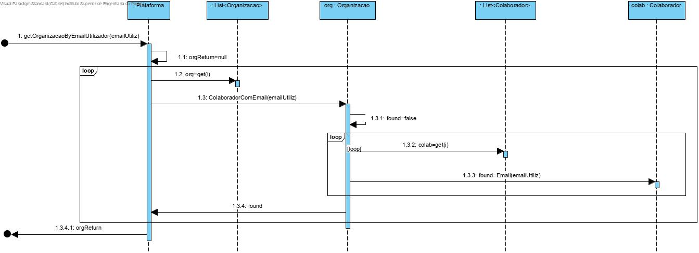

# UC8 - Publicar Tarefa

## Formato Breve
O colaborador de organização inicia a publicação de um novo anúncio. O Sistema mostra a lista de tarefas disponíveis.Seleciona uma tarefa.É apresentada a lista de regimentos aplicáveis, pedindo que o colaborador selecione uma das opções. O regimento é selecionado e solicitado o período de publicitação da tarefa na plataforma, o período de apresentação de candidaturas pelos freelancers e o período de seriação da tarefa a um freelancer.O Colaborador insere os períodos, respetivamente.O Sistema valida a informação, pedindo ao colaborador que o confirme. O anúncio é publicado.

## SSD

## Formato Completo

### Ator principal

Colaborador de Organização

### Partes interessadas e seus interesses

* **Freelancers**: Pretende ter tarefas disponíveis para ficar ativo.
* **T4J**: Pretende que a plataforma permita listar tarefas de organizações.
* **Organizacao**: Pretende fazer a seriação dos candidatos para realizarem a tarefa possuida por esta.

### Pré-condições

Colaborador registado no sistema e numa organização.

### Pós-condições

A lista das tarefas publicadas ser registada no sistema.

## Cenário de sucesso principal (ou fluxo básico)

1. O colaborador de organização inicia a publicação de um novo anúncio.
2. O Sistema mostra a lista de tarefas disponíveis.
3. O Colaborador de organização seleciona uma tarefa.
4. O Sistema apresenta a lista de regimentos aplicáveis, pedindo que o colaborador selecione uma das opções apresentadas.
5. O colaborador seleciona o regimento pretendido.
6. O Sistema solicita o período de publicitação da tarefa na plataforma, o período de apresentação de candidaturas pelos freelancers e o período de seriação da tarefa a um freelancer.
7. O Colaborador insere os períodos, respetivamente.
8. O Sistema valida a informação, pedindo ao colaborador que o confirme.
9. O colaborador confirma o anúncio.
10. O sistema regista o anúncio com sucesso.

### Extensões (ou fluxos alternativos)
*a. O colaborador de organização solicita o cancelamento da publicação da tarefa.
> O caso de uso termina.

2a. O sistema não tem tarefas disponíveis.
> O caso de uso termina.

3a. O sistema deteta que já existe anúncio disponivel para essa tarefa.
> 1. O sistema informa o colaborador de organização desse facto.
> 2. O sistema permite a alteração (passo 2)
>
	>  2a. O colaborador não altera a tarefa escolhida. O caso de uso termina.

4a. O colaborador não insere períodos obrigatórias.
> 1. O sistema informa o colaborador de organização quais as especificações em falta.
> 2. O sistema permite a introdução das especificações em falta (passo 5)
>
	>  2a. O cliente não altera os dados. O caso de uso termina.

6b. O sistema deteta que as especificações introduzidas (ou algum subconjunto dos dados) são inválidas.
> 1. O sistema informa o colaborador de organização desse facto.
> 2. O sistema permite a alteração (passo 5)
>
	>  2a. O colaborador não altera os dados. O caso de uso termina.

7a. O colaborador de organização não confirma.
> 1.O sistema permite a alteração dos dados.

> 2.O caso de uso termina.

### Requisitos especiais
-

### Lista de Variações de Tecnologias e Dados
-

### Frequência de Ocorrência
-

### Questões em aberto

* Um colaborador pode alterar a descrição da tarefa, assim como a sua categoria?
* Haverá um minimo de tarefas para os colaboradores começarem a publicar?
* Qual a frequência de ocorrência deste caso de uso?
* Poderá haver mais do que um anuncio para a mesma tarefa?

## 2. Análise OO

### Excerto do Modelo de Domínio Relevante para o UC

## 3. Design - Realização do Caso de Uso

### Racional

| Fluxo Principal | Questão: Que Classe... | Resposta  | Justificação  |
|:--------------  |:---------------------- |:----------|:---------------------------- |
| 1. O colaborador de organização inicia a publicação de um novo anúncio.		 |	... interage com o utilizador? | PublicarAnuncioUI   |  Pure Fabrication, pois não se justifica atribuir esta responsabilidade a nenhuma classe existente no Modelo de Domínio. |
|  		 |	... coordena o UC?	| PublicarAnuncioController | Controller    |
|  		 |	... cria instância de anúncio?| Anuncio | Creator (Regra1)   |
|  		 |	... conhece a organização do colaborador?	| RegistoOrganizacoes |  |
|||Organização | IE: A organização conhece os seus colaboradores |
||| Colaborador | IE: conhece os seus dados (email)
| 2. O Sistema mostra a lista de tarefas disponíveis		 | ... conhece a lista de tarefas?| Organizacao | 	IE: no MD a Organização possui todas as instâncias de Tarefa.|
| 3. O Colaborador de organização seleciona uma tarefa  |	... guarda a categoria selecionada?|   Organização | possui os próprios dados - no MD o Anuncio é referente a uma Tarefa  |
| 4. O Sistema apresenta a lista de regimentos aplicáveis		 |		... conhece a lista de regimentos?  |   Plataforma | no MD a Plataforma possui todas os regimentos.    |
| 5. O colaborador seleciona o regimento pretendido.      |	... guarda o regimento selecionada?|   Anuncio |  O Anuncio contem o regimento  |
| 6. O Sistema solicita o período de publicitação da tarefa na plataforma, o período de apresentação de candidaturas pelos freelancers e o período de seriação da tarefa a um freelancer. | ... guarda os dados introduzidos?|  Anuncio |  Information Expert (IE)-instância criada no passo 1: possui os seus próprios dados.                            |
| 7.  O Colaborador insere os períodos.	| ... guarda os dados introduzidos?| Anuncio |IE: O Anuncio possui os seus próprios dados|
| 8.  O Sistema valida a informação e aguarda confirmação. 		 |... valida os dados do Anúncio (validação local)? | RegistarAnuncio  |IE: possui os seus próprios dados. |
||... valida os dados da Tarefa (validação global)?| plataforma | IE: a Plataforma contém/agrega Anuncio.|
| 9.  O Colaborador confirma os dados. | |   | |
|10.  O Sistema regista o anúncio. 		 | ... guarda o Anuncio criado?| plataforma  |Plataforma contém/agrega Anúncio. |

### Sistematização ##

 Do racional resulta que as classes conceptuais promovidas a classes de software são:

 * Organizacao
 * Colaborador
 * Plataforma

Outras classes de software (i.e. Pure Fabrication) identificadas:  

 * PublicarTarefaUI  
 * PublicarTarefaController

Outras classes de sistemas/componentes externos:

 * SessaoUtilizador
 * AutorizacaoFacade

###	Diagrama de Sequência

Diagrama secundário:

###	Diagrama de Classes

