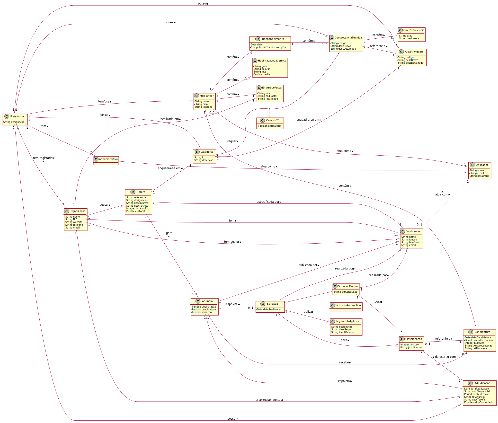

# Análise OO #
O processo de construção do modelo de domínio é baseado nos casos de uso, em especial os substantivos utilizados, e na descrição do enunciado.
## Racional para identificação de classes de domínio ##
Para a identificação de classes de domínio usa-se a lista de categorias das aulas TP (sugeridas no livro). Como resultado temos a seguinte tabela de conceitos (ou classes, mas não de software) por categoria.

### _Lista de Categorias_ ###

**Transações (do negócio)**

* Anúncio
* Candidatura
* Seriação

---

**Linhas de transações**

* Classificação

---

**Produtos ou serviços relacionados com transações**

* Tarefa

---

**Registos (de transações)**

*  Adjudicação

---  

**Papéis das pessoas**

* Administrativo
* Freelancer
* Colaborador (de Organização)
* Gestor (de Organizacao)
* Utilizador
* Utilizador Não Registado

---

**Lugares**

*  Endereço Postal
* Plataforma

---

**Eventos**

* Seriacao
* Candidatura

---

**Objectos físicos**

*

---

**Especificações e descrições**

*  Área de Atividade
*  Competência Técnica
*  Tarefa
*  Categoria Tarefa
*  Regimento Aplicável
*  Habilitacao Academica
*  Grau Proficiencia
*  Reconhecimento

---

**Catálogos**

*  

---

**Conjuntos**

*  Lista de Competencias Técnicas Requeridas

---

**Elementos de Conjuntos**

*  Caráter de Competência Técnica Requerida

---

**Organizações**

*  T4J (Plataforma)
*  Organização

---

**Outros sistemas (externos)**

*  (Componente Gestão Utilizadores)
* Algoritmo (Externo) Gerador de Passwords

---

**Registos (financeiros), de trabalho, contractos, documentos legais**

* Regimento Aplicavel

---

**Instrumentos financeiros**

*  

---

**Documentos referidos/para executar as tarefas/**

*
---

###**Racional sobre identificação de associações entre classes**###

Uma associação é uma relação entre instâncias de objectos que indica uma conexão relevante e que vale a pena recordar, ou é derivável da Lista de Associações Comuns:

+ A é fisicamente (ou logicamente) parte de B
+ A está fisicamente (ou logicamente) contido em B
+ A é uma descrição de B
+ A é conhecido/capturado/registado por B
+ A usa ou gere B
+ A está relacionado com uma transacção de B
+ etc.

| Conceito (A) 		|  Associação   		|  Conceito (B) |
|----------	   		|:-------------:		|------:       |
| Administrativo  	| define    		 	| Área de Atividade  |
|   					| define            | Competência Técnica  |
|   					| trabalha para     | Plataforma  |
|						| atua como			| Utilizador |
| Plataforma			| tem registadas    | Organização  |
|						| tem     			| Freelancer  |
|						| tem     			| Administrativo  |
| 						| possui     			| Competência Técnica  |
| 						| possui     			| Área de Atividade  |
|	|tem |Anuncio|
||possui |RegimentoAplicavel
|CategoriaTarefa | possui | CompetenciaTécnica|
| CompetênciaTécnica| referente a       | Área de Atividade  |
|								|contém|GrauProficiencia|
|Tarefa| catalogada em| CategoriaTarefa
||pode gerar|Anuncio
|Anuncio|publicita|Tarefa
||espoleta|Seriacao
||recebe|Candidatura
||conduzido por | RegimentoAplicável
Seriacao|gera|Classificacao
||aplica|RegimentoAplicável|
Candidatura|enviada a |Anuncio
|Classificacao|referente a |Candidatura
| Organizacao			| possui      	   | EndereçoPostal  |
|						| tem gestor     	| Colaborador |
|						| tem		     		| Colaborador |
|           |possui| Tarefa
| Gestor (de Organização)| é um (papel de)| Colaborador |
| Freelancer			| atua como			| Utilizador |
|								|faz|Candidatura
|								|contém|Reconhecimento
|								|contém|HabilitacaoAcademica
|								|contém|EnderecoPostal
| Reconhecimento			| possui		| CompetenciaTecnica |
| Colaborador			| atua como			| Utilizador |
||especifica|Tarefa
||publica| Anuncio
|Adjudicação| corresponde a uma| Organização
|| espoletada por | Anuncio
|| De acordo com | Classificacao/Resultado de uma Seriacao

## Modelo de Domínio

