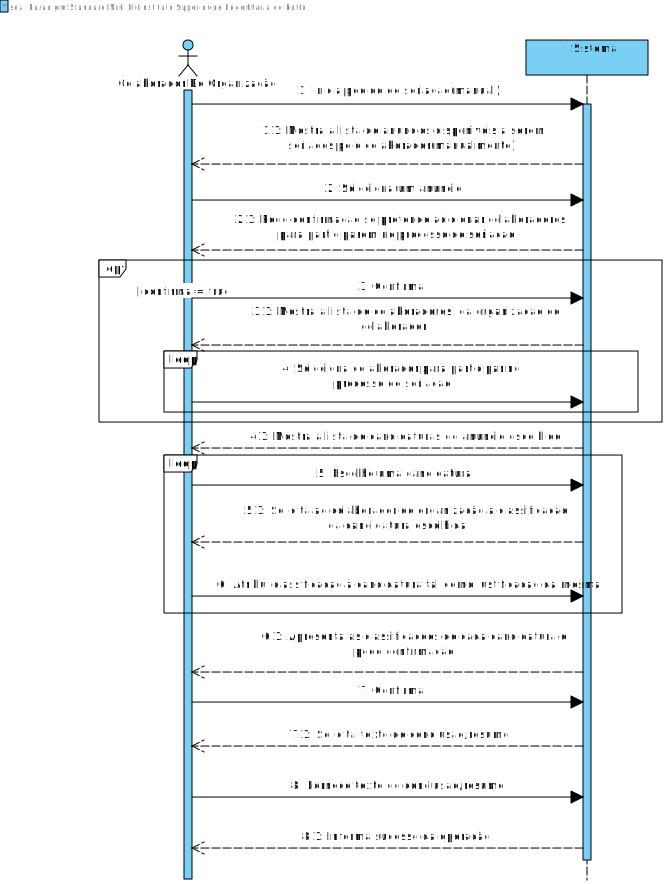
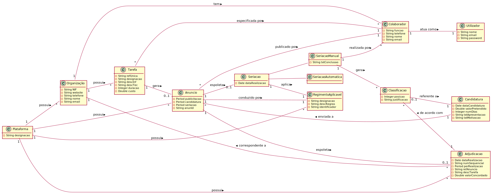
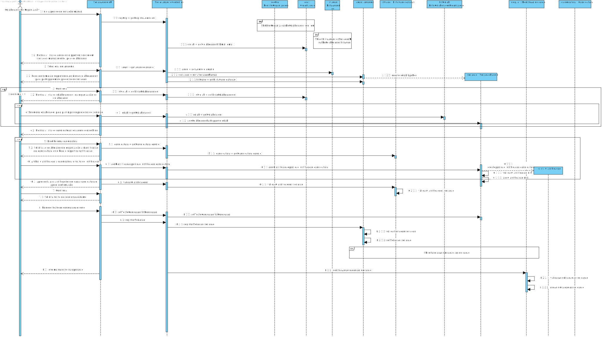
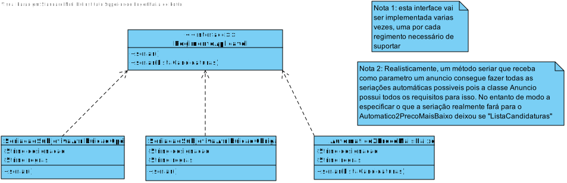

# UC10 - Seriar Anuncio

## Formato Breve

O colaborador de organização inicia pedido de seriação(manual). O sistema mostra a lista de anuncios publicados anteriormente pelo colaborador. O colaborador escolhe um. O sistema mostra a lista de colaboradores da organização do colaborador. O colaborador seleciona outros colaboradores para participarem no processo de seriação. O sistema mostra a lista de candidaturas. O colaborador organiza/classifica as candidaturas de acordo com o regimento aplicável apresentando tambem um texto de justificacao da classificacao. O sistema valida e apresenta as classificações das candidaturas feitas pelo colaborador pedindo que confirme. O colaborador de organização confirma. O sistema solicita um texto de conclusão. O colaborador fornece o texto de conclusão. O sistema regista as classificações de cada candidatura tal como a data em que este processo ocorreu, seus participantes, texto de conclusão e adjudicação e informa o colaborador de organização do sucesso da operação.

## SSD

## Formato Completo

### Ator principal

Colaborador de Organização

### Partes interessadas e seus interesses

* **Colaborador de Organização**: Pretende efetuar seriação dos candidatos a uma tarefa em nome de uma determinada organização.
* **Freelancers**: Pretende ser escolhido para fazer uma determinada tarefa.
* **T4J**: Pretende que a plataforma permita classificar/ordenar candidatos a uma tarefa.
* **Organizacao**: Pretende fazer a seriação dos candidatos para realizarem a tarefa possuida por esta.

### Pré-condições

Existir um ou mais anuncios possiveis de serem seriados pelo colaborador.

### Pós-condições

A classificação das candidaturas e outros dados associados com o processo de seriação são registados no sistema.

## Cenário de sucesso principal (ou fluxo básico)

1. O colaborador de organização inicia pedido de seriação(manual).
2. O sistema mostra a lista de anuncios publicados pelo colaborador disponiveis a serem seriados(manualmente) pelo mesmo.
3. O colaborador escolhe um anuncio.
4. O sistema pede confirmação ao colaborador se pretende adicionar outros colaboradores de sua organização para participar no processo de seriação.
5. **Se o colaborador não confirma passa para o passo 9**.
6. O sistema mostra a lista de colaboradores de organização da organização do colaborador.
7. O colaborador de organizacão escolhe um colaborador para participar no processo.
8. **O passo 7 repete-se até serem selecionados todos os colaboradores pretendidos.**
9. O sistema mostra a lista de candidaturas do anuncio escolhido.
10. O colaborador de organização escolhe uma candidatura da lista.
11. O sistema solicita ao colaborador de organização a classificação da candidatura escolhida e justificação da mesma.
12. O colaborador de organização atribui a classificação pretendida da candidatura (de 1 até ao numero de candidaturas) tal como a justificação.
13. **Os passos 10 a 12 repetem-se até todas as candidaturas possuirem uma classificação justificada.**
14. O sistema valida e apresenta as classificações de cada candidatura ao colaborador, pedindo confirmação.
15. O colaborador de organização confirma.
16. O sistema solicita ao colaborador um texto de conclusão/resumo da seriação realizada.
17. O colaborador fornece o texto de conclusão/resumo.
18. O sistema regista as classificações de cada candidatura tal como a data em que este processo ocorreu, seus participantes, texto de conclusão e adjudicação e informa o colaborador de organização do sucesso da operação.

### Extensões (ou fluxos alternativos)

*a. O colaborador de organização solicita o cancelamento do processo de seriação.
> O caso de uso termina.

2a. O sistema deteta que a lista de anuncios possiveis de ser seriados manualmente pelo colaborador está vazia.
> O caso de uso termina.

3a. O sistema deteta que o colaborador de organização não tem acesso ao processo de seriação do anuncio escolhido (ex: não foi este que a publicou).
> O caso de uso termina.

6a. O sistema deteta que a lista de colaboradores está vazia.
> 1. O sistema informa o colaborador desse facto.
> 2. O sistema avança para o passo 9.

9a. O sistema deteta que a lista de candidaturas está vazia.
> O caso de uso termina.

14a. O sistema deteta que as classificações não estão feitas de acordo com o regimento aplicável.
> 1. O sistema informa o colaborador de organização desse facto.
> 2. O sistema permite a alteração (passo 4)
>
	>  2a. O colaborador não altera as classificações das candidaturas. O caso de uso termina.

14b. O sistema deteta que existem candidaturas com a mesma classificação
> 1. O sistema informa o colaborador de organização desse facto.
> 2. O sistema permite a alteração (passo 2)
>
	>  2a. O colaborador não altera as classificações da lista. O caso de uso termina.

15a. O colaborador de organização não confirma.
> O sistema permite a alteração da classificação da lista.

17a. O colaborador de organização não fornece um texto de conclusão/resumo.
> O caso de uso termina.

18a. O regimento aplicável do anuncio implica uma adjudicação opcional.
> 1. O sistema regista as classificações de cada candidatura tal como a data em que este processo ocorreu, seus participantes e o texto de conclusão informando o colaborador de organização do sucesso da operação.
> 2. O caso de uso termina.

### Requisitos especiais
-

### Lista de Variações de Tecnologias e Dados
-

### Frequência de Ocorrência
-

### Questões em aberto

* Haverá um minimo de candidatos para a seriação poder ser realizada?
* Existe um minimo de colaboradores participantes para a seriação poder ser realizada?
* Este caso de uso só pode ser iniciado por colaboradores que tenham gerado anúncios?
* Qual a frequência de ocorrência deste caso de uso?
* È realmente necessário classificar todas as candidaturas? Ou haverá possibilidade de por exemplo, fazer só o top 3.
* Poderá haver candidaturas com a mesma classificação (empate)? Se sim, haverá critério de desempate?
* Todas as classificações têm de possuir um texto de justificação?
* O texto de conclusão/resumo é obrigatório?

## 2. Análise OO

### Excerto do Modelo de Domínio Relevante para o UC

## 3. Design - Realização do Caso de Uso

### Racional

| Fluxo Principal | Questão: Que Classe... | Resposta  | Justificação  |
|:--------------  |:---------------------- |:----------|:---------------------------- |
| 1. O colaborador de organização inicia pedido de seriação(manual).	 |	... interage com o utilizador? | SeriarAnuncioUI   |  Pure Fabrication, pois não se justifica atribuir esta responsabilidade a nenhuma classe existente no Modelo de Domínio. |
|  		 |	... coordena o UC?	| SeriarAnuncioController | Controller    |
|  		 |	... cria instância de Seriacao| Anuncio | Creator (Regra1)   |
||...conhece os requisitos/regras da seriacao a aplicar?|RegimentoAplicavel|Protected Variation
|  		 |	... conhece a organização do colaborador?	| RegistoOrganizacoes | HC/LC |
|||Organização | IE: A organização conhece os seus colaboradores |
||| Colaborador | IE: conhece os seus dados (e.g email)
||conhece o utilizador/gestor a utilizar o sistema?|SessaoUtilizador | IE: documentação do componente de gestão de utilizadores.
| 2. O sistema mostra a lista de anuncios publicados pelo colaborador disponiveis a serem seriados(manualmente) pelo colaborador.		 |...conhece todos os anuncios disponiveis? |  RegistoAnuncios | HC/LC|
||...tem conhecimento dos anuncios disponiveis **a serem seriados pelo colaborador**|RegistoAnuncios|IE: RegistoAnuncios conhece todos os anuncios, e, como tal, todos os anuncios publicados pelo colaborador.
| 3. O Colaborador escolhe um anuncio 	  | |
| 4. O sistema pede confirmação ao colaborador se pretende adicionar outros colaboradores de sua organização para participar no processo de seriação.
| 5. Se o colaborador não confirma  passa para o passo 9.		 |                          |
| 6.  O sistema mostra a lista de colaboradores de organização da organização do colaborador.		 |		... tem conhecimento sobre outros colaboradores da organização do colaborador? | RegistoOrganizacoes | HC/LC |
|||Organização | IE: A organização conhece os seus colaboradores |
|||ListaColaborador| HC/LC|
| 7.  O colaborador de organizacão escolhe um colaborador para participar no processo.		 | ...guarda o colaborador escolhido?|   SeriacaoManual| IE: instância criada no passo 1: possui uma lista de colaboradores participantes |
| 8.  **O passo 7 repete-se até serem selecionados todos os colaboradores pretendidos.**| |
| 9. O sistema mostra a lista de candidaturas do anuncio escolhido.	 |		...tem conhecimento sobre a lista de candidaturas do anuncio escolhido?  |   ListaCandidaturas | HC/LC    |
| 10. O colaborador de organização escolhe uma candidatura da lista.		 | ...tem guardada a candidatura escolhida?|  Anuncio |  IE: No modelo de dominio, Anuncio recebe candidaturas. 
|||ListaCandidatura| HC/LC                          |
| 11.  O sistema solicita ao colaborador de organização a classificação da candidatura escolhida tal como sua justificacao.		 | 
| 12.  O colaborador de organização atribui a classificação pretendida da candidatura (de 1 até ao numero de candidaturas), tal como a justificação da mesma	  | ...guarda a classificação e sua justificacao? | Classificacao |IE: No MD, Classificação é referente a Candidatura e gerada por SeriacaoManual|
| |...valida a Classificação atribuida(validacão local)? | Classificacao|IE: No MD, classificação é referente a Candidatura|
|| ...valida a Classificação atribuida(validação global)? | ListaCandidaturas|IE: ListaCandidatura possui atributos gerais, tais como o numero máximo de posições.|
| 13.  **Os passos 10 a 12 repetem-se até todas as candidaturas possuirem uma classificação.**
| 14.  O sistema valida e apresenta as classificações de cada candidatura ao colaborador, pedindo confirmação.| ...valida os dados da Seriacao realizada como um todo(validação local)? | Seriacao|IE: Seriacao possui os seus próprios dados|
|| ...valida os dados da Seriacao realizada como um todo(validação global)?| Anuncio | IE: No MD, Seriacao aplica um regimento, e Anuncio tem conhecimento sobre este||
| 15.  O colaborador de organização confirma.		 | |   | |
| 16.  O sistema solicita ao colaborador um texto de conclusão/resumo da seriação realizada		 | 
| 17.  O colaborador fornece o texto de conclusão/resumo.	  | ...guarda o texto de conclusão? | SeriacaoManual|IE: Instância criada no passo 1|
| 18.  O sistema regista as classificações de cada candidatura tal como a data em que este processo ocorreu, seus participantes, texto de conclusão e adjudicação final e informa o colaborador de organização do sucesso da operação.|  ...guarda a Seriacao realizada?| Anuncio| Creator(Regra1) |
|| ...cria e valida instância de adjudicação? | RegistoAdjudicacao |  HC/LC |
|| ...guarda a instância de adjudicação? | RegistoAdjudicacao | HC/LC
|| ...sabe se a adjudicação é obrigatoria/automática? | RegimentoAplicavel | Protected Variation
|| ...conhece o freelancer a ser atribuida a realização da tarefa? | SeriacaoManual | IE: Seriacao conhece todas as classificações de cada candidatura, logo conhece o vencedor.
|| ...conhece a organização que adjudicou a tarefa? | RegistoOrganizacoes | HC/LC
|| ...conhece a tarefa que originou o anuncio e os seus dados? | Anuncio | IE: Anuncio possui uma tarefa e tem conhecimento de seus próprios dados
|| ...conhece o periodo de realizacao e o valor acordado da candidatura vencedora? | Candidatura | IE: possui os seus próprios dados.
||... conhece o Id do anuncio? | Anuncio | IE: conhece seus próprios dados
|| ...conhece a data em que o processo ocorreu? | Date |IE: instância criada no passo 1|
|| ... notifica o utilizador? |SeriarAnuncioUI ||

## Sistematização ##

 Do racional resulta que as classes conceptuais promovidas a classes de software são:
 
* Classificacao 
* Adjudicacao
* Candidatura
* Anuncio
* Seriacao
* SeriacaoManual
* Date
* Classificacao
* RegimentoAplicavel

Outras classes de software (i.e. Pure Fabrication) identificadas:

* ListaCandidaturas
* RegistoOrganizacoes
* RegistoAnuncios 
* SeriarAnuncioUI
* SeriarAnuncioController
 
Outras classes de sistemas/componentes externos:

* SessaoUtilizador

## Diagrama de Sequência ##

**SD**

## Diagrama de Classes ##

