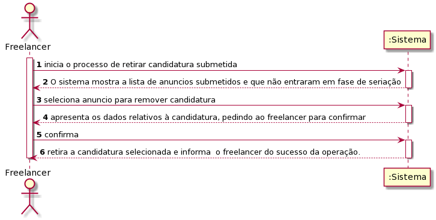
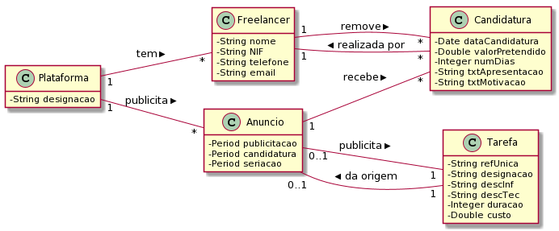
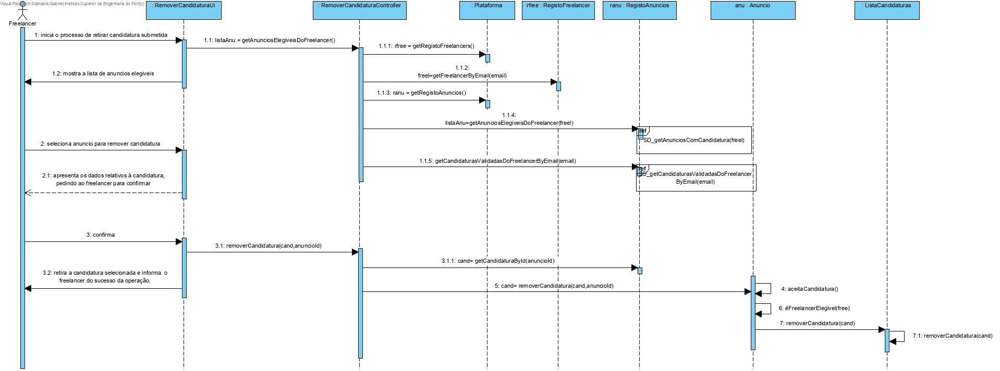
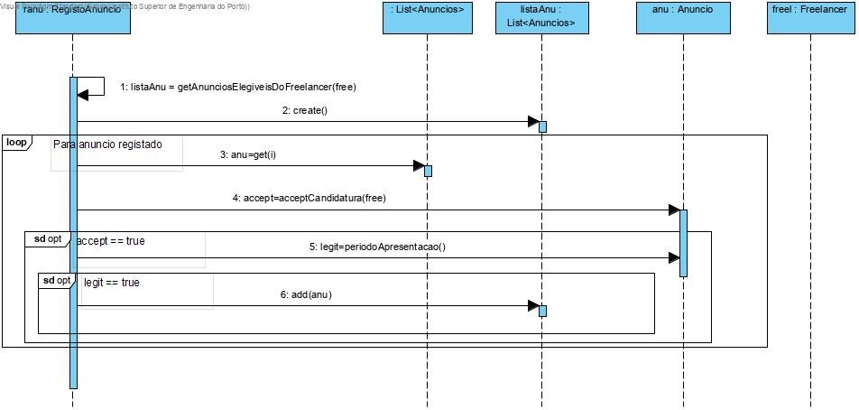
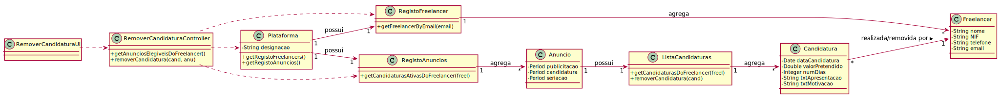

# UC12 - Retirar Candidatura Submetida

## 1. Engenharia de Requisitos

### Formato Breve
O freelancer inicia o processo de retirar candidatura submetida. O sistema mostra a lista candidaturas submetidas e que não entraram em fase de seriação, solicitando que este selecione uma delas. Seleciona a candidatura. O freelancer confirma. O sistema retira a candidatura selecionada e informa  o freelancer do sucesso da operação.

### SSD

### Formato Completo

#### Ator principal

Freelancer

#### Partes interessadas e seus interesses

* **Freelancer:** pretende remover a sua candidatura a um dos anúncios.
* **Organização:** pretende remover candidaturas para as Tarefas publicadas por parte de Freelancers desinteressados.
* **T4J:** pretende remover candidaturas para posteriormente deixar de atribuir as tarefas a Freelancers desinteressados. 

#### Pré-condições
Existencia de candidaturas submetidas a um anuncio.

#### Pós-condições
Remover candidatura ao respetivo anúncio.

### Cenário de sucesso principal (ou fluxo básico)

1. O freelancer inicia o processo de retirar candidatura submetida.
2. O sistema mostra a lista anuncios submetidos e que não entraram em fase de seriação, solicitando que este selecione uma delas.
3. O freelancer seleciona o anuncio para remover candidatura.
4. O sistema apresenta os dados relativos à candidatura, pedindo ao freelancer para confirmar.
5. O freelancer confirma.
6. O sistema retira a candidatura selecionada e informa  o freelancer do sucesso da operação.

#### Extensões (ou fluxos alternativos)

*a. O freelancer solicita o cancelamento do processo de retirar uma candidatura submetida.

> O caso de uso termina.

2a. O sistema deteta que a lista de candidaturas está vazia.

> O caso de uso termina.

2b. A candidatura pretendida já foi submetida para fase de seriação.

> O caso de uso termina.

6a. O freelancer não confirma.
> 1. O sistema alerta o freelancer para o facto.
> 2. O sistema permite a alteração da candidatura (passo 2).
>
	> 2a. O freelancer não altera a candidatura. O caso de uso termina.

#### Requisitos especiais
\-

#### Lista de Variações de Tecnologias e Dados
\-

#### Frequência de Ocorrência
\-

#### Questões em aberto

* Qual a frequência de ocorrência deste caso de uso?
* A candidatura também poderá vir a ser removida por um colaborador?
* É possivel remover a candidatura caso já esteja em processo de seriação?
* Após ser removida da plataforma, os dados devem ficar guardados por algum tempo no sistema?
* Caso seja removida a candidatura a um anúncio, poderá o freelancer candidatar-se à mesma? 

## 2. Análise OO

### Excerto do Modelo de Domínio Relevante para o UC

## 3. Design - Realização do Caso de Uso

### Racional

| Fluxo Principal | Questão: Que Classe... | Resposta  | Justificação  |
|:--------------  |:---------------------- |:----------|:---------------------------- |
| 1. O freelancer inicia o processo de retirar candidatura submetida.   		 |	... interage com o utilizador? | RemoverCandidaturaUI    |  Pure Fabrication: não se justifica atribuir esta responsabilidade a nenhuma classe existente no Modelo de Domínio. |
|  		 |	... coordena o UC?	| RemoverCandidaturaController | Controller    |
||...conhece o utilizador/freelancer a usar o sistema?|SessaoUtilizador|IE: cf. documentação do componente de gestão de utilizadores.|
||...conhece o Freelancer?|Plataforma|IE: conhece todos os Freelancers.|
|||RegistoFreelancer|HC/LC|
| 2. O sistema mostra a lista de anuncios elegíveis.	 |conhece os anuncios? |Plataforma|  IE: no MD a Plataforma possui Anúncios. ||
| |conhece as Candidaturas? |Anuncio|  IE: O Anuncio possui as candidaturas ||
| | |ListaCandidaturas| HC/LC ||
||...conhece as Candidaturas válidas para remoção?|Anuncio|O Anuncio conhece os seus dados|
||...conhece o autor da candidatura?|Candidatura|A candidatura conhece os seus dados|
|||PeriodoApresentacao|HC/LC|
| 3. O freelancer seleciona a candidatura.  		 |	|   |  |
| 4. O sistema apresenta os dados relativos à candidatura do anuncio escolhido, pedindo ao freelancer para confirmar.  		 |	 | | |
| 5. O freelancer confirma.   		 |	...valida dos dados	da Candidatura?	 | Candidatura  | IE: Possui os seus proprios dados.|
||ListaCandidaturas|Por aplicação HC+LC delega a ListaCandidaturas|                           
| 6. O sistema retira a candidatura selecionada e informa  o freelancer do sucesso da operação. |	... remove a candidatura? | Anuncio | IE: O Anúncio guarda a informação das suas Candidaturas.|
|	|  | ListaCandidatura| HC/LC |
|	| ... informa o Freelancer do sucesso? | EfetuarCandidaturaUI| |

### Sistematização ##

 Do racional resulta que as classes conceptuais promovidas a classes de software são:

 * Plataforma
 * Colaborador
 * Candidatura
 * Freelancer
 * Anúncio

Outras classes de software (i.e. Pure Fabrication) identificadas:  

 * RemoverCandidaturaUI
 * RemoverCandidaturaController
 * ListaCandidaturas

###	Diagrama de Sequência

**SD_getAnunciosComCandidatura(freel)**

**SD_getCandidaturasValidadasDoFreelancerByEmail(email)**

###	Diagrama de Classes

