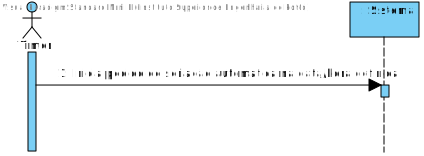
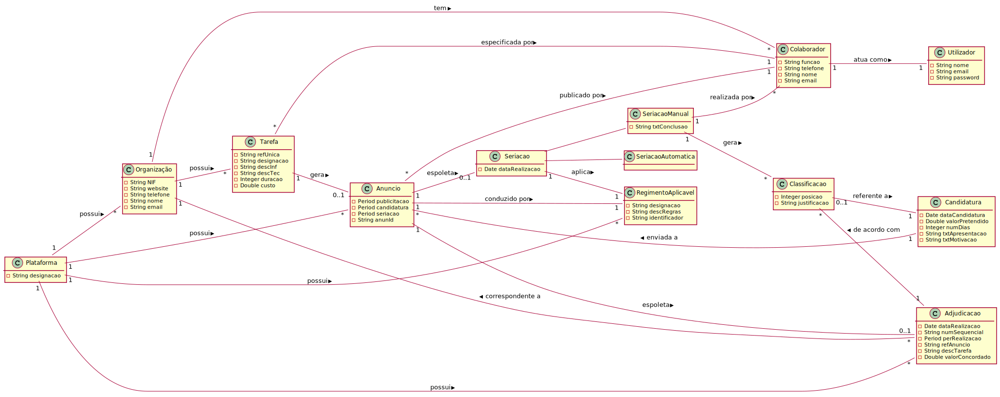
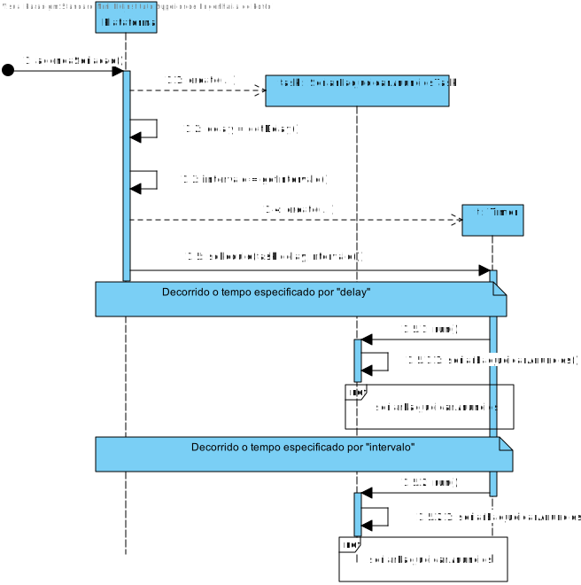
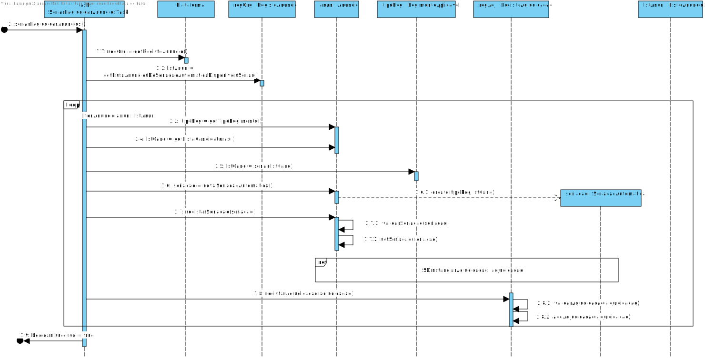
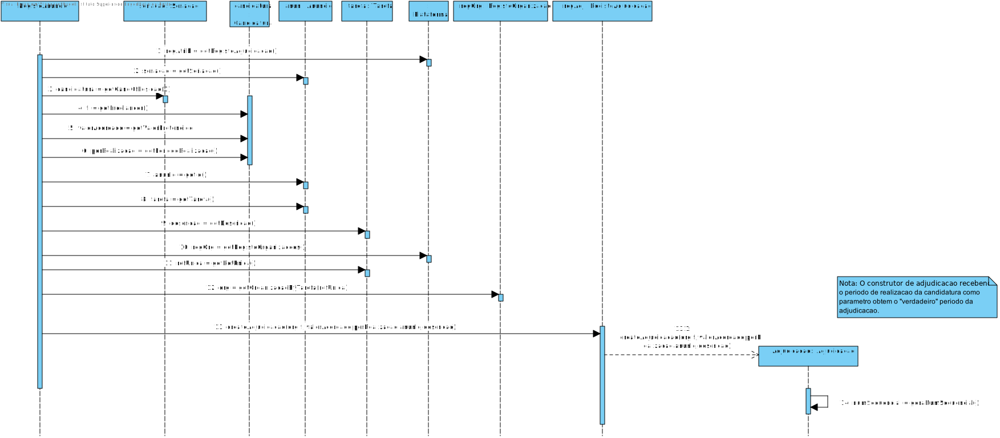
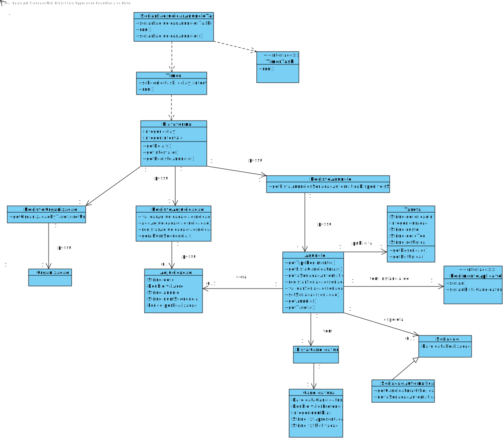
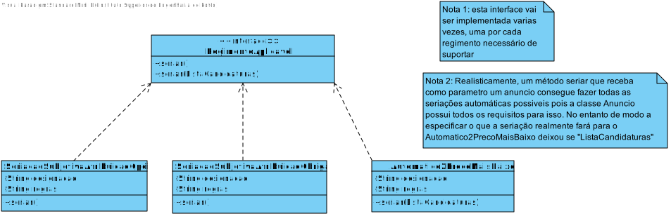

# UC13 - Seriar Automaticamente Anuncio

## Formato Breve

O Timer inicia pedido de seriação na hora definida (02:15h). O sistema verifica todos os anuncios em que o tipo de regimento implica uma seriacao automatica e o periodo de apresentacao de candidaturas e o periodo de publicitacao já terminou, recolhendo-os. O sistema realiza a seriação das candidaturas de cada um dos anuncios recolhidos conforme os objetivos de cada regimento. O sistema guarda os resultados da seriacao e adjudicação tal como a data e hora em que o processo ocorreu.

## SSD

# Formato Completo

### Ator principal

Timer

### Partes interessadas e seus interesses

* **Freelancers**: Pretende ser escolhido para fazer uma determinada tarefa.
* **T4J**: Pretende que a plataforma permita classificar/ordenar candidatos a uma tarefa de forma automática.
* **Organizacao**: Pretende que a sua tarefa seja realizada, e, como tal, que seja realizada a seriacao das candidaturas ao anuncio que esta gerou.

### Pré-condições

Haver pelo menos um anuncio em condição de ser seriado automaticamente.

### Pós-condições

A classificação/ordenação das candidaturas e outros dados associados com o processo de seriação automático tal como a adjudicação, são registados no sistema.

## Cenário de sucesso principal (ou fluxo básico)

1. O timer inicia pedido de seriacao na hora definida.
2. O sistema verifica e recolhe todos os anuncios em condições para serem seriados automaticamente.
3. O sistema realiza a seriação do primeiro anuncio por seriar da lista de acordo com os critérios de seu regimento.
4. O sistema realiza a adjudicação final do anuncio seriado.
5.  O sistema guarda os resultados da seriacao e adjudicação tal como a data e hora em que o processo ocorreu. 
6. **Os passos 3 a 5 repetem-se até a lista recolhida não ter mais anuncios por seriar**

### Extensões (ou fluxos alternativos)

2a. O sistema deteta que não existem anuncios em condições de serem seriados automaticamente.
> O caso de uso termina.

3a. O sistema deteta que não tem disponiveis mecanismos para poder realizar a seriacao do anuncio.
> O sistema remove o anuncio e avança para o passo seguinte.
> 
4a. O sistema deteta que o tipo de regimento do anuncio implica uma adjudicação opcional.
> O sistema guarda os resultados da seriacao tal como a data e hora em que o processo ocorreu.
> O sistema avança para o passo 6.

### Requisitos especiais
-

### Lista de Variações de Tecnologias e Dados
-

### Frequência de Ocorrência

Na data/hora definida.

### Questões em aberto

* Haverá um minimo de candidatos a um determinado anuncio para a seriação poder ser realizada?
* Poderá haver candidaturas com a mesma classificação no final do processo? Se sim, haverá critério de desempate?
* Alguém tem de ser notificado da conclusão desta operação?
* Caso o sistema não tenha disponiveis mecanismos de seriação para um determinado regimento, alguem tem de ser notificado disto?

## 2. Análise OO

### Excerto do Modelo de Domínio Relevante para o UC

## 3. Design - Realização do Caso de Uso

### Racional
| Fluxo Principal | Questão: Que Classe... | Resposta  | Justificação  |
|:--------------  |:---------------------- |:----------|:---------------------------- |
| 1.  O timer inicia pedido de seriacao na hora definida.	 | ...coordena o UC?| SeriarEadjudicarAnuncioTask| Definida no timer.
||... cria instância de seriacao automatica? | Anuncio | Creator(Regra1)
||..conhece a hora definida? | Plataforma | Creator(Regra1) - Plataforma possui um timer
|||Timer | IE: Timer conhece os seus próprios dados
|2. O sistema verifica e recolhe todos os anuncios em condições para serem seriados automaticamente.|...conhece todos os anuncios disponiveis? | RegistoAnuncios | HC/LC
||...conhece todos os anuncios que implicam uma seriação automatica? | RegistoAnuncios| IE e Protected Variation: RegistoAnuncio conhece todos os anuncios e estes possuem uma instancia de RegimentoAplicavel que aplica Protected Variation.
|| ...sabe que anuncios já terminou o periodo de apresentação e publicitação? | RegistoAnuncios | HC/LC e IE: conhece todos os anuncios e seus dados.
|3.O sistema realiza a seriação do primeiro anuncio por seriar da lista de acordo com os critérios de seu regimento, guardando os resultados da mesma. |...conhece o tipo de regimento e os critérios deste que serão aplicados? |Anuncio | IE e Protected Variation: Anuncio possui uma instãncia de RegimentoAplicavel que aplica Protected Variation
|||RegimentoAplicavel | Protected Variation
|4. O sistema realiza a adjudicação final do anuncio| ...cria e valida instância de adjudicação? | RegistoAdjudicacao |  HC/LC |
|| ...sabe se a adjudicação é obrigatoria/automática? | RegimentoAplicavel | Protected Variation
|| ...conhece a organização que adjudicou a tarefa? | RegistoOrganizacoes | HC/LC
|| ...conhece a tarefa que originou o anuncio e os seus dados? | Anuncio | IE: Anuncio possui uma tarefa e tem conhecimento de seus próprios dados
||...conhece o Id do anuncio? | Anuncio | IE: conhece seus próprios dados
|| ...conhece o periodo de realizacao, o valor acordado e o freelancer a ser atribuida a tarefa? | Seriacao | IE: instância criada no passo 3 contem uma lista de candidaturas ordenada conforme o regimento aplicavel.
| ||Candidatura | IE: possusi os seus próprios dados.
|5. O sistema guarda os resultados da seriacao e adjudicação tal como a data e hora em que o processo ocorreu.|  ...guarda a Seriacao realizada?| Anuncio| Creator(Regra1) |
|| ...guarda a instância de adjudicação? | RegistoAdjudicacao | HC/LC
|| ...conhece a data em que o processo ocorreu? | Date |IE: instância criada no passo 1|
|6. **Os passos 3 a 5 repetem-se até a lista recolhida não ter mais anuncios por seriar**|

## Sistematização ##

 Do racional resulta que as classes conceptuais promovidas a classes de software são:
 
* Plataforma
* Adjudicacao
* Candidatura
* Anuncio
* Seriacao
* SeriacaoAutomatica
* Date
* RegimentoAplicavel

Outras classes de software (i.e. Pure Fabrication) identificadas:

* RegistoAdjudicacao
* RegistoAnuncios 
* SeriarEadjudicarAnuncioTask
 
Outras classes de sistemas/componentes externos:

* Timer

## Diagrama de Sequência ##

**SD**

## Diagrama de Classes ##

