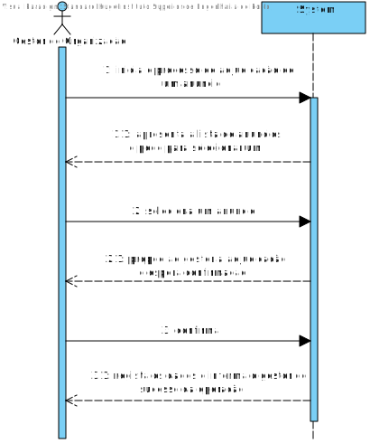
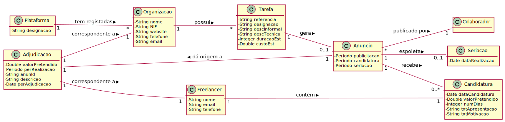
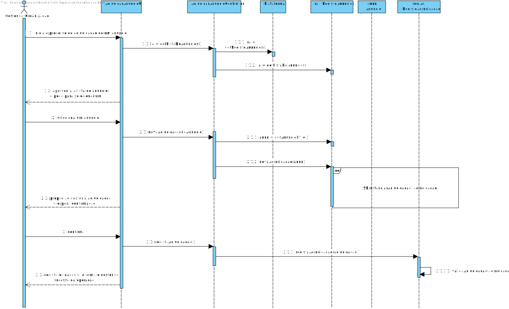
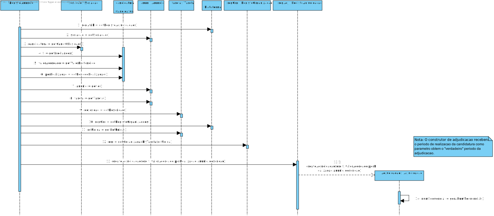
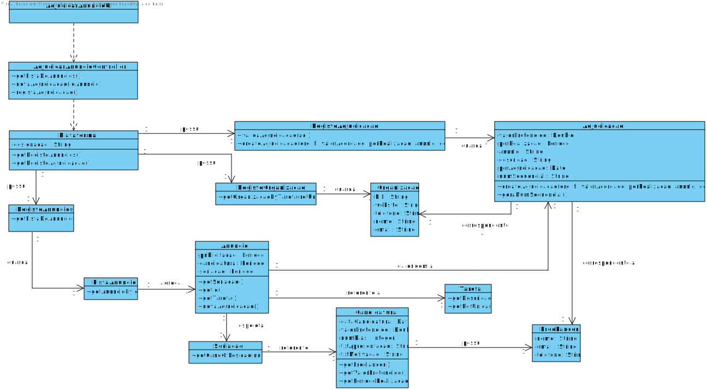

# UC14 - Adjudicar Anuncio Manualmente

## Formato Breve

O Gestor de Organizacão inicia o processo de adjudicação de um anúncio. O sistema apresenta a lista de anúncios e pede para selecionar um. O Gestor de Organização seleciona um anúncio. O sistema propõe ao gestor a adjudicação e espera confirmação. O Gestor de Organização confirma. O sistema regista os dados e informa o gestor do sucesso da operação.

## SSD

## Formato Completo

### Ator principal

Gestor de Organização

### Partes interessadas e seus interesses

* **Gestor de Organização**: Pretende efetuar a adjudicação dos anúncios disponiveis.
* **Freelancers**: Pretendem ser atribuidos a um anúncio de modo a realiza-lo.
* **T4J**: Pretende que a plataforma permita atribuir anúncios a candidaturas colocadas.
* **Organização**: Pretende atribuir anuncios a candidaturas de modo a prestar serviços.

### Pré-condições

Têm de existir anuncios com seriação já realizada na organização do colaborador.

### Pós-condições

A adjudicação do anúncio fica registada no sistema.

## Cenário de sucesso principal (ou fluxo básico)

1. O Gestor de Organizacão inicia o processo de adjudicação de um anúncio.
2. O sistema apresenta a lista de anúncios e pede para selecionar um.
3. O Gestor de Organização seleciona um anúncio.
4. O sistema propõe ao gestor a adjudicação e espera confirmação.
5. O Gestor de Organização confirma.
6. O sistema regista os dados e informa o gestor do sucesso da operação.

### Extensões (ou fluxos alternativos)

*a. O Gestor de Organizacão solicita o cancelamento do processo de seriação.
> O caso de uso termina.

2a. O sistema deteta que a lista de anuncios disponiveis está vazia.
> O caso de uso termina.

6a. O sistema deteta que a lista de candidaturas está vazia.
> O caso de uso termina.

15a. O Gestor de Organizacão não confirma.
> O sistema permite que escolha a candidatura a adjudicar.

### Requisitos especiais
-

### Lista de Variações de Tecnologias e Dados
-

### Frequência de Ocorrência
-

### Questões em aberto

* Caso o Gestor de Organização recuse a proposta de adjudicação, o Gestor de Organização tem de escolher apenas candidatura de freelancer a adjudicar ao anúncio, ou pode alterar/escolher mais dados?

## 2. Análise OO

### Excerto do Modelo de Domínio Relevante para o UC

## 3. Design - Realização do Caso de Uso

### Racional

| Fluxo Principal | Questão: Que Classe... | Resposta  | Justificação  |
|:--------------  |:---------------------- |:----------|:---------------------------- |
| 1. Inicia o processo de adjudicação de um anúncio.	 |	... interage com o utilizador? | AdjudicarAnuncioUI   |  Pure Fabrication, pois não se justifica atribuir esta responsabilidade a nenhuma classe existente no Modelo de Domínio. |
|  		 |	... coordena o UC?	| AdjudicarAnuncioController | Controller    |
|  		 |	... conhece a lista de anuncios?	| RegistoAnuncios | HC/LC |
|  		 |	... conhece o registo dos anuncios?	| Plataforma | IE: Plataforma agrega registos |
| 2. O sistema apresenta a lista de anúncios e pede para selecionar um.		 | |   | |
| 3. O Gestor seleciona um anúncio. 	  | ... possui os anuncios?| RegistoAnuncios | HC+LC|
||... possui a seriacao?| Anuncio | IE: Anuncio conhece a seriação
||... possui a candidatura? | Seriacao | IE: Seriacao conhece a candidatura
||... possui o freelancer? | Candidatura | IE: Seriacao conhece a candidatura
||... conhece as organizações? | RegistoOrganizacao | HC+LC
||... possui a tarefa? | Anuncio | IE: Anuncio conhece a Tarefa
||... cria a instancia Adjudicação? | RegistoAdjudicacao | Creator
||... valida os dados da Adjudicação? (Validação Local) | Adjudicacao | IE: Adjudicacao possui os seus proprios dados
| 4. O sistema propõe ao gestor a adjudicação e espera confirmação.
| 5. O gestor confirma	 |          ... valida os dados da Adjudicação? (Validação Global) | RegistoAdjudicacao | HC/LC
||  ...guarda a Adjudicacao realizada?| RegistoAdjudicacao| HC/LC |
| 6.  O sistema regista as classificações de cada candidatura tal como a data em que este processo ocorreu e seus participantes e informa o colaborador de organização do sucesso da operação.| ... notifica o utilizador? |SeriarAnuncioUI | Pure Fabrication|*

## Sistematização ##

 Do racional resulta que as classes conceptuais promovidas a classes de software são:

* Plataforma
* Anuncio
* Seriacao
* Candidatura
* Tarefa
* Adjudicacao

Outras classes de software (i.e. Pure Fabrication e HC/LC) identificadas:

* RegistoAnuncios
* RegistoAdjudicacao
* RegistoOrganizacao
* AdjudicarAnuncioUI
* AdjudicarAnuncioController

## Diagrama de Sequência ##

**SD**

**Ref mencionada**

## Diagrama de Classes ##

