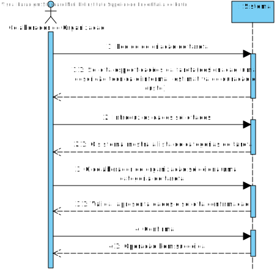
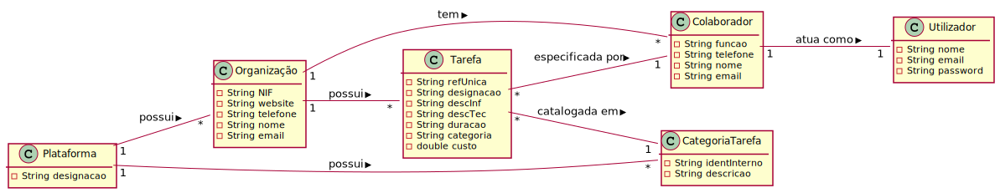
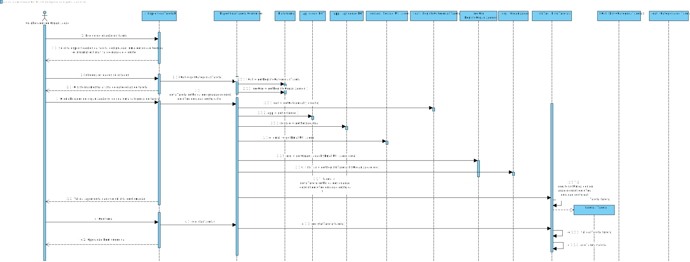
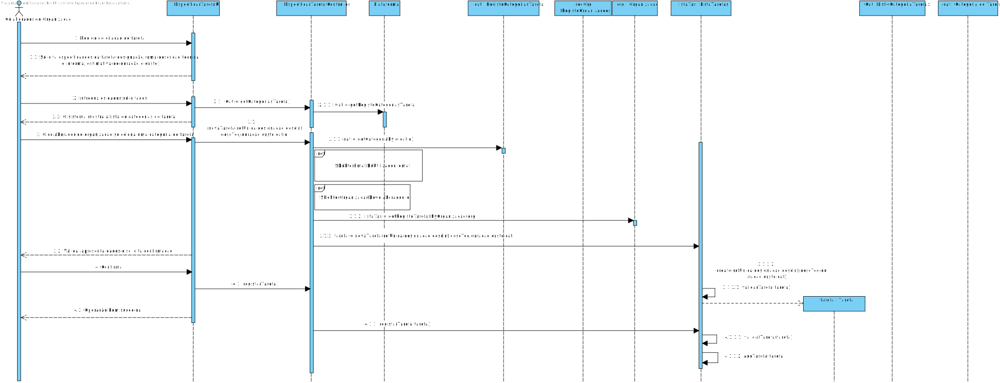
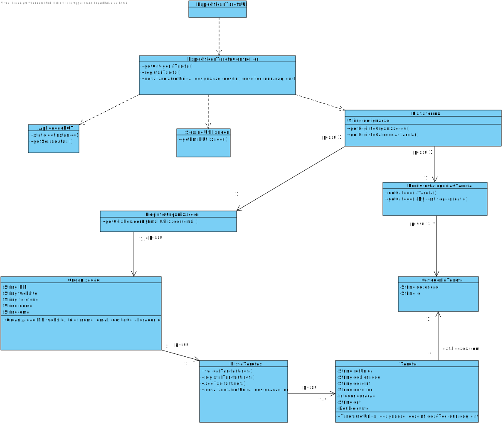

# UC6 - Especificar Tarefa

## Formato Breve

O colaborador de organização inicia a criação de uma nova tarefa. O sistema apresenta as especificações relacionadas à criação da tarefa (i.e. duração, custo, descrição). O colaborador de organização introduz as mesmas.O sistema mostra a lista de categorias de tarefa e pede para selecionar uma.O colaborador seleciona uma categoria de tarefa. O sistema valida e apresenta os dados pedindo que os confirme. O colaborador de organização confirma.O sistema regista os dados e informa o colaborador de organização do sucesso da operação.

## SSD

## Formato Completo

### Ator principal

Colaborador de Organização

### Partes interessadas e seus interesses

* **Colaborador de Organização**: Pretende efetuar pedido de prestação de serviços em nome de uma determinada organização.
* **Freelancers**: Pretende realizar as tarefas publicadas pelas organizações.
* **T4J**: Pretende que a plataforma permita catalogar as tarefas pretendidas pelas organizações e posterior realização das mesmas.

### Pré-condições
O colaborador de organização deve estar registado no sistema.

### Pós-condições
O pedido de prestação de serviços é registado no sistema.

## Cenário de sucesso principal (ou fluxo básico)

1. O colaborador de organização seleciona a opção criação de uma nova tarefa.
2. O sistema apresenta as especificações relacionadas à criação da tarefa (i.e. descrição técnica e informal, custo e duração da tarefa).
3. O colaborador de organização introduz as especificações supramencionadas.
4. O sistema mostra a lista de categorias de tarefa e pede para selecionar uma
5. O colaborador de organização seleciona uma categoria de tarefa
6. O sistema valida e apresenta os dados ao colaborador de organização, pedindo que os confirme.
7. O colaborador de organização confirma.
8. O sistema regista os dados e informa o colaborador de organização do sucesso da operação.

### Extensões (ou fluxos alternativos)
*a. O colaborador de organização solicita o cancelamento do pedido de prestação de serviços.
> O caso de uso termina.

2a. O sistema não tem especificações disponíveis.
> O caso de uso termina.

4a. O sistema não tem categorias de tarefa disponíveis
> O caso de uso termina

6a. Especificações mínimas obrigatórias em falta.
> 1. O sistema informa o colaborador de organização quais as especificações em falta.
> 2. O sistema permite a introdução das especificações em falta (passo 5)
>
	>  2a. O cliente não altera os dados. O caso de uso termina.

6b. O sistema deteta que as especificações introduzidas (ou algum subconjunto dos dados) são inválidas.
> 1. O sistema informa o colaborador de organização desse facto.
> 2. O sistema permite a alteração (passo 4)
>
	>  2a. O cliente não altera os dados. O caso de uso termina.

7a. O colaborador de organização não confirma.
> O sistema permite a alteração dos dados.

### Requisitos especiais
-

### Lista de Variações de Tecnologias e Dados
-

### Frequência de Ocorrência
-

### Questões em aberto

* A referência única é fornecida pelo sistema inicialmente ou introduzida pela organização e posteriormente validada aquando a realização do pedido?
* É necessário todas as especificações relacionadas/há especificações obrigatórias para a criação de uma tarefa (i.e. duração e custo do pedido)?
* É possivel que uma tarefa possuia mais que uma categoria de tarefa?
* Qual a frequência de ocorrência deste caso de uso?
* A lista de categorias pode ser extensa. Faz sentido permitir filtros (e.g. por área de atividade) e/ou pesquisa (e.g. pela descrição)?
* Quando a categoria pretendida não existe, é necessário recolher alguma informação ou notificar alguém que isso aconteceu?

## 2. Análise OO

### Excerto do Modelo de Domínio Relevante para o UC

## 3. Design - Realização do Caso de Uso

### Racional

| Fluxo Principal | Questão: Que Classe... | Resposta  | Justificação  |
|:--------------  |:---------------------- |:----------|:---------------------------- |
| 1. O Colaborador de Organização inicia a criação de uma nova tarefa		 |	... interage com o utilizador? | EspecificarTarefaUI   |  Pure Fabrication, pois não se justifica atribuir esta responsabilidade a nenhuma classe existente no Modelo de Domínio. |
|  		 |	... coordena o UC?	| EspecificarTarefaController | Controller    |
|  		 |	... cria instância de Tarefa? | ListaTarefas | HC/LC    |
|  		 |	... conhece a organização do colaborador?	| RegistoOrganizacoes| HC/LC |
|||Organização | IE: A organização conhece os seus colaboradores |
||| Colaborador | IE: conhece os seus dados (e.g email)
||conhece o utilizador/gestor a utilizar o sistema?|SessaoUtilizador | IE: documentação do componente de gestão de utilizadores.
| 2. O sistema solicita os dados necessários (i.e. código único, descrição breve e descrição detalhada).  		 | |  | |
| 3. O Colaborador de Organização introduz os dados solicitados (descrição técnica e informal, custo e duração da tarefa,designação e categoria de tarefa)  |	... guarda os dados introduzidos?  |   Tarefa | Information Expert (IE) - instância criada no passo 1     |
|  | ...possui o atributo categoria de tarefa? | CategoriaTarefa | IE: No Modelo de Dominio, CategoriaTarefa possui o seu identificador   | |   | |
| 4. O sistema mostra a lista de categorias de tarefa e pede para selecionar uma		 |		... tem conhecimento sobre as categorias de tarefa existentes?  |   RegistoCategoriasTarefa | HC/LC    |
| 5. O Colaborador de organização seleciona uma Categoria de Tarefa		 | ...guarda a Categoria de Tarefa?|  Tarefa |  IE: No modelo de dominio, Tarefa está catalogada numa Categoria de Tarefa- instância criada no passo 1                            |
| 6.  O sistema valida e apresenta os dados ao colaborador de organização, pedindo que os confirme.		 | ...valida os dados da Tarefa(validação local)? | Tarefa |IE: A Tarefa possui os seus próprios dados|
|| ...valida os dados de Tarefa(validação global)?| ListaTarefas | HC/LC ||
| 7.  O administrativo confirma.  		 | |   | |
| 8. O sistema regista a tarefa e informa o colaborador de organização do sucesso da operação. |  ...guarda a Tarefa especificada/criada?| ListaTarefas| HC/LC |
|| ... notifica o utilizador? | EspecificarTarefaUI||

## Sistematização ##

 Do racional resulta que as classes conceptuais promovidas a classes de software são:
 

* Organização
* Plataforma
* Tarefa
* CategoriaTarefa

Outras classes de software (i.e. Pure Fabrication, HC+LC) identificadas:

* RegistoTarefas
* RegistoCategoriasTarefa
* RegistoOrganizacoes
* EspecificarTarefaUI
* EspecificarTarefaController
 
Outras classes de sistemas/componentes externos:

* SessaoUtilizador

## Diagrama de Sequência ##

**SD sem refs**

**SD com refs**

## Diagrama de Classes ##

