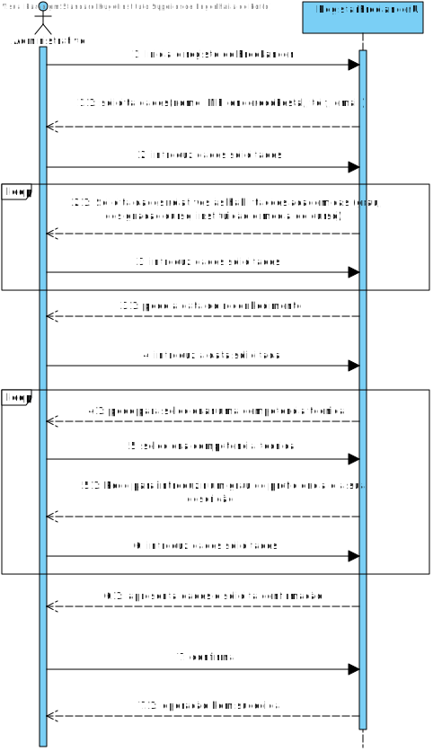
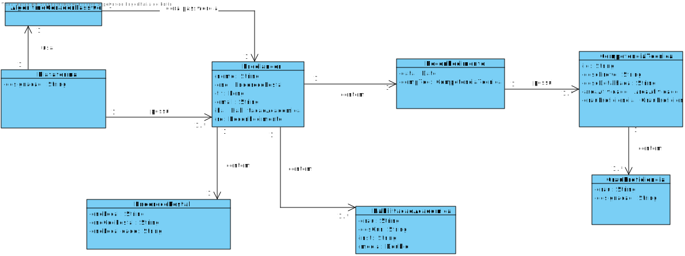
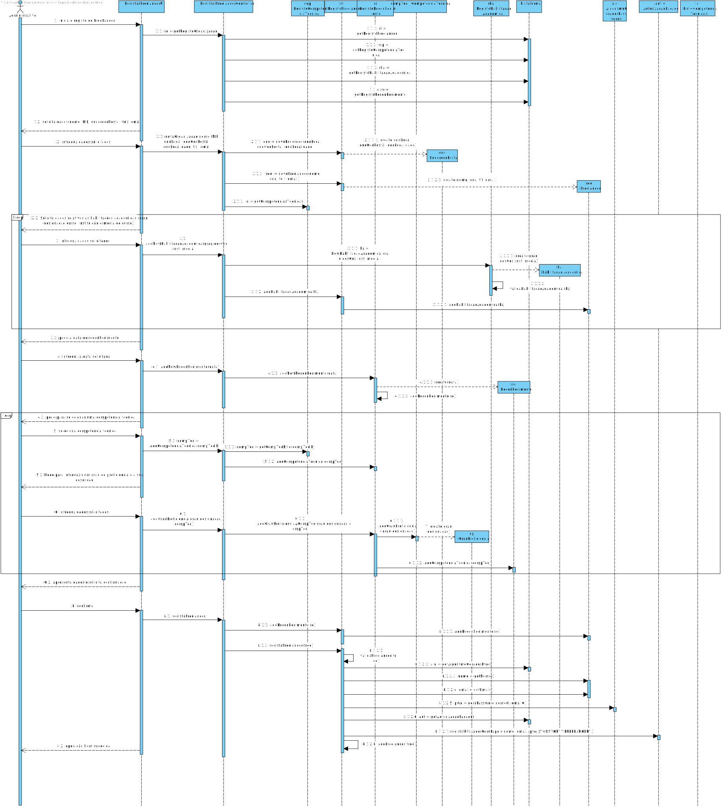
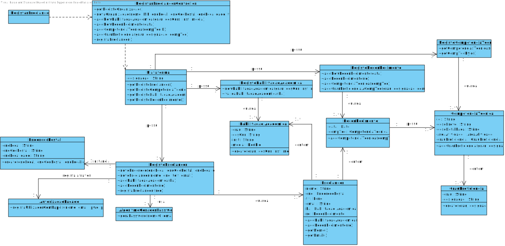

# UC7 - Registar Freelancer

## 1. Engenharia de Requisitos

### Formato Breve

O administrativo inicia o registo de um novo Freelancer. O sistema solicita os dados (nome, NIF, endereço Postal, telefone e email). O administrativo introduz os dados solicitados. O sistema solicita dados relativos às habilitações académicas(grau, designação curso, instituição e média de curso). O administrativo introduz os dados solicitados. O sistema pede a data do reconhecimento. O administrativo introduz a data. O sistema pede para selecionar uma competência técnica. O administrativo seleciona a competência técnica. O sistema pede para introduzir um grau de proficiência e a sua descrição. O administrativo introduz os dados solicitados. O sistema apresenta os dados e solicita confirmação. O administrativo confirma. O sistema informa o administrativo do sucesso da operação e regista os dados em sistema.

### SSD

### Formato Completo

#### Ator principal

Administrativo

#### Partes interessadas e seus interesses
* **Administrativo:** pretende registar freelancers de modo a poder atribuir-lhes tarefas.
* **T4J:** pretende que a plataforma contenha freelancers que possam concluir tarefas.
* **Freelancer** pretende trabalhar para a empresa e executar tarefas, só o pudendo fazer caso esteja registado.

#### Pré-condições
Existirem competências técnicas em sistema.

#### Pós-condições
A informação do Freelancer é registada no sistema.

### Cenário de sucesso principal (ou fluxo básico)

1. O administrativo inicia o registo de um novo Freelancer.
2. O sistema solicita os dados (nome, NIF, endereço Postal, telefone e email).
3. O administrativo introduz os dados solicitados.
4. O sistema solicita dados relativos às habilitações académicas(grau, designação curso, instituição e média de curso).
5. O administrativo introduz os dados solicitados.
6. O sistema pede a data do reconhecimento.
7. O administrativo introduz a data.
8. O sistema pede para selecionar uma competência técnica.
9. O administrativo seleciona a competência técnica.
10. O sistema pede para introduzir um grau de proficiência e a sua descrição.
11. O administrativo introduz os dados solicitados.
12. O sistema apresenta os dados e solicita confirmação.
13. O administrativo confirma.
14. O sistema informa o administrativo do sucesso da operação e regista os dados em sistema.

- Nota: Os passos 4 a 5 e 8 a 12 repetem-se num loop.
#### Extensões (ou fluxos alternativos)

*a. O administrativo solicita o cancelamento do registo do Freelancer

> O caso de uso termina.

2a. Dados mínimos obrigatórios em falta.
>	1. O sistema informa quais os dados em falta.
>	2. O sistema permite a introdução dos dados em falta (passo 3)
>
	>	2a. O administrativo não altera os dados. O caso de uso termina.

2b. O sistema deteta que os dados (ou algum subconjunto dos dados) introduzidos devem ser únicos e que já existem no sistema.
>	1. O sistema alerta o administrativo para o facto.
>	2. O sistema permite a sua alteração (passo 3)
>
	>	2a. O administrativo não altera os dados. O caso de uso termina.

2c. O sistema deteta que os dados introduzidos (ou algum subconjunto dos dados) são inválidos.
> 1. O sistema alerta o administrativo para o facto.
> 2. O sistema permite a sua alteração (passo 3).
>
	> 2a. O administrativo não altera os dados. O caso de uso termina.

4a. O sistema não possui nenhuma competência técnica.
> O caso de uso termina.

#### Requisitos especiais
\-

#### Lista de Variações de Tecnologias e Dados
\-

#### Frequência de Ocorrência
\-

#### Questões em aberto

* Existem outros dados que são necessários?
* Todos os dados são obrigatórios?
* Qual a frequência de ocorrência deste caso de uso?
* Os reconhecimentos são criados neste caso de uso ou já existem em sistema (sendo necessário ir busca-los pela data)?
* Como é que o freelancer toma conhecimento que foi registado?

## 2. Análise OO

### Excerto do Modelo de Domínio Relevante para o UC

## 3. Design - Realização do Caso de Uso

### Racional

| Fluxo Principal | Questão: Que Classe... | Resposta  | Justificação  |
|:--------------  |:---------------------- |:----------|:---------------------------- |
| 1. O administrativo inicia o registo de um novo Freelancer.   		 |	... interage com o utilizador? | RegistarFreelancerUI    |  Pure Fabrication, pois não se justifica atribuir esta responsabilidade a nenhuma classe existe no Modelo de Domínio. |
|  		 |	... coordena o UC?	| RegistarFreelancerController | Controller    |
| 2. O sistema solicita os dados (nome, NIF, endereço Postal, telefone e email).  		 | |  | |
| 3. O administrativo introduz os dados solicitados.  |... conhece as competencias tecnicas a listar?|  RegistoCompetenciaTecnica | Information Expert (IE)    |
|  		 |	... cria instância de EnderecoPostal? | RegistoFreelancer   | HC+LC   |
|  		 |	... cria instância de Freelancer? | RegistoFreelancer   | HC+LC   |
| 4. O sistema solicita dados relativos às habilitações académicas(grau, designação curso, instituição e média de curso).   		 |	  |  |  |
| 5. O administrativo introduz os dados solicitados.		 |  ... cria HabilitacaoAcademica?          |RegistoHabilitacaoAcademica  |                HC+LC            |
| 	 |  ... valida HabilitacaoAcademica?          |RegistoHabilitacaoAcademica  |               IE          |
| 	 |  ... guarda HabilitacaoAcademica?          |Freelancer  |               IE - Instancia criada no passo 3          |
|6. O sistema pede a data do reconhecimento.|||
|7. O administrativo introduz a data.|...cria instância de Reconhecimento|RegistoReconhecimento|HC+LC|
||...guarda o Reconhecimento?|RegistoReconhecimento| HC+LC
| 8.  O sistema pede para selecionar uma competência técnica.  		 |  |  | |
| 9.  O administrativo seleciona a competência técnica.  		 | ...conhece as competencias tecnicas?| RegistoCompetenciaTecnica  | HC+LC|
|| ...guarda a competencia tecnica?| Reconhecimento  | IE : Instância criada no passo 7
| 10. O sistema pede para introduzir um grau de proficiência e a sua descrição. |  |  | |
| 11. O administrativo introduz os dados solicitados. |  ...cria o GrauProficiencia?| RegistoReconhecimento | HC+LC |
|| ...guarda o GrauProficiencia?| Reconhecimento  | IE : Instância criada no passo 7
| 12. O sistema apresenta os dados e solicita confirmação. |  |  |  |
| 13. O administrativo confirma. |  ...guarda o freelancer criada?| RegistoFreelancer | HC+LC |
|| ... valida os dados do freelancer(validacao local)? | Freelancer    |IE. possui os próprios dados|
|| ... valida os dados do freelancer(validacao global)? | RegistoFreelancer    |IE. o RegistoFreelancer agrega todos os freelancers|
|| ... guarda o freelancer no sistema? | AutorizacaoFacade    |IE. A gestão de utilizadores é responsabilidade do componente externo respetivo cujo ponto de interação é através da classe "AutorizacaoFacade"|
| 14. O sistema informa o administrativo do sucesso da operação e regista os dados em sistema. |   ... notifica o utilizador? | EspecificarCompetenciaTecnicaUI    ||

### Sistematização ##

 Do racional resulta que as classes conceptuais promovidas a classes de software são:

 * Plataforma
 * HabilitacaoAcademica
 * Freelancer
 * Reconhecimento
 * EnderecoPostal
 * GrauProficiencia
 * CompetenciaTecnica

Outras classes de software (i.e. Pure Fabrication e HC+LC) identificadas:

 * RegistarFreelancerUI
 * RegistarFreelancerController
 * RegistoFreelancer
 * RegistoCompetenciaTecnica
 * RegistoReconhecimento
 * RegistoHabilitacaoAcademica
 * AlgoritmoGeradorPasswords

###	Diagrama de Sequência

###	Diagrama de Classes

