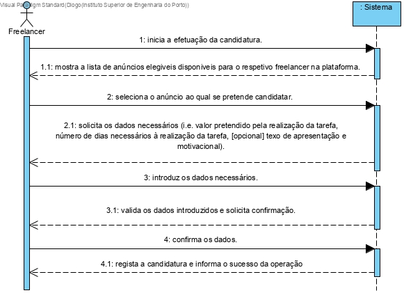
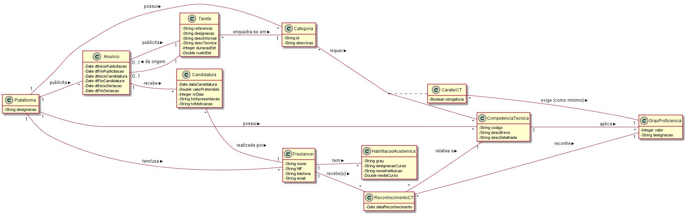
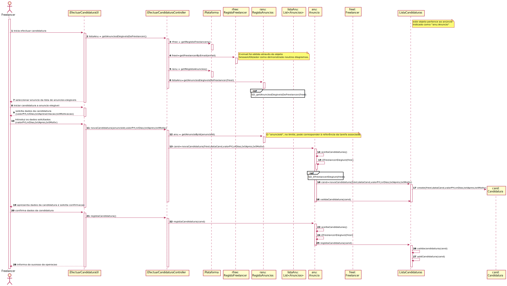
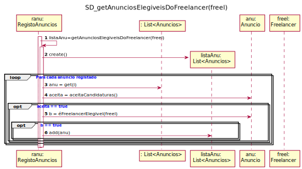

# UC9 - EfetuarCandidatura

## Formato Breve

O freelancer inicia a efetuação da candidatura. O sistema mostra a lista de anúncios elegiveis disponiveis para o respetivo freelancer na plataforma. O freelancer seleciona o anúncio ao qual se pretende candidatar.  O sistema solicita os dados necessários (i.e. valor pretendido pela realização da tarefa, número de dias necessários à realização da tarefa, [opcional] texo de apresentação e motivacional). O freelancer introduz os dados necessários. O sistema valida os dados introduzidos e solicita confirmação. O freelancer confirma os dados . O sistema regista a candidatura e informa o sucesso da operação.

## SSD

## Formato Completo

### Ator principal

Freelancer

### Partes interessadas e seus interesses

* **Colaborador de Organização:** pretende receber Candidaturas aos Anúncios publicados.
* **Organização:** pretende receber Candidaturas para as Tarefas publicadas para execução por Freelancers.
* **Freelancer:** pretende conhecer os Anúncios a que se pode candidatar e apresentar a sua Candidatura.
* **T4J:** pretende receber Candidaturas para posterior atribuição das tarefas a Freelancers.

### Pré-condições

### Pós-condições

As candidaturas dos freelancers são registadas no sistema.

## Cenário de sucesso principal (ou fluxo básico)

1. O freelancer inicia a efetuação da candidatura.
2. O sistema mostra a lista de anúncios elegiveis disponiveis para o respetivo freelancer na plataforma.
3. O freelancer seleciona o anúncio ao qual se pretende candidatar.
4. O sistema solicita os dados necessários (i.e. valor pretendido pela realização da tarefa, número de dias necessários à realização da tarefa, [opcional] texo de apresentação e motivacional).
5. O freelancer introduz os dados necessários.
6. O sistema valida os dados introduzidos e solicita confirmação
7. O freelancer confirma os dados.
8. O sistema regista a candidatura e informa o sucesso da operação.

### Extensões (ou fluxos alternativos)

*a. O freelancer solicita o cancelamento da candidatura.
> O caso de uso termina.

*2a. O sistema deteta que a lista de anuncios está vazia.
> O caso de uso termina.

*2b. O sistema não deteta os grau minimos necessários do freelancer.
> O caso de uso termina.

*2c. O sistema deteta que o freelancer já se tinha candidatado a este anúncio.
> O caso de uso termina.

*3a. O freelancer não tem acesso aos anúncios
> O caso de uso termina.

6a. Dados mínimos obrigatórios em falta.
>	1. O sistema informa quais os dados em falta.
>	2. O sistema permite a introdução dos dados em falta (passo 4).
>
	>	2a. O freelancer não altera os dados. O caso de uso termina.

6b. O sistema deteta que os dados (ou algum subconjunto dos dados) introduzidos devem ser únicos e que já existem no sistema.
>	1. O sistema alerta o freelancer para o facto.
>	2. O sistema permite a sua alteração (passo 4).
>
	>	2a. O freelancer não altera os dados. O caso de uso termina.

6c. O sistema deteta que os dados introduzidos (ou algum subconjunto dos dados) são inválidos.
> 1. O sistema alerta o freelancer para o facto.
> 2. O sistema permite a sua alteração (passo 4).
>
	> 2a. O freelancer não altera os dados. O caso de uso termina.

7a. O freelancer não confirma.
> O sistema permite a alteração dos dados.

### Requisitos especiais
-

### Lista de Variações de Tecnologias e Dados
-

### Frequência de Ocorrência
-

### Questões em aberto

## 2. Análise OO

### Excerto do Modelo de Domínio Relevante para o UC

## 3. Design - Realização do Caso de Uso

### Racional

| Fluxo Principal | Questão: Que Classe... | Resposta  | Justificação  |
|:--------------  |:---------------------- |:----------|:---------------------------- |
| 1. O freelancer inicia a efetuação da candidatura |... interage com o utilizador?|EfectuarCandidaturaUI	|Pure Fabrication|
| |...coordena o UC?	 				| EfectuarCandidaturaController	| Controller    |Pure Fabrication|
| |...cria instância de Candidatura? 			| Anúncio | Creator (Regra1): no MD o Anúncio recebe Candidaturas|
| |							| ListaCandidaturas | IE: no MD o Anúncio recebe Candidaturas. Por aplicação de HC+LC delega a ListaCandidaturas|
| |...conhece o utilizador/Freelancer a usar o sistema?	|SessaoUtilizador|IE: cf. documentação do componente de gestão de utilizadores.|
| |...conhece o Freelancer ?				|Plataforma|conhece todos os Freelancers|
| |				|RegistoFreelancer|Por aplicação de HC+LC delega a RegistoFreelancer|
| 2.  O sistema mostra a lista de anúncios elegiveis disponiveis para o respetivo freelancer na plataforma.|... conhece as anuncios? |Plataforma|IE: no MD a Plataforma possui Anúncios. |
| | 						     | RegistoAnuncios	|IE: no MD a Plataforma possui Anuncios. Por aplicação de HC+LC delega a RegistoAnuncios|
| |...conhece os Anúncios elegíveis para o Freelancer| Freelancer 	| O Freelancer possui Reconhecimentos de Competências Técnicas | IE |  
| | 						     | Reconhecimento	| O Reconhecimento confirma o GrauProficiência do freelancer numa Competência Técnica | IE |  
| | 						     | Anúncio		| O Anúncio é relativo a uma Tarefa | IE: no MD o Anúncio é relativo a uma Tarefa |
| | 						     | Tarefa		| A Tarefa tem uma Categoria de Tarefa associada | IE: no MD a Tarefa é relativa a uma Categoria de Tarefa |
| | 						     | Categoria | A Categoria de Tarefa possui Carácter das Competências Técnicas | IE: no MD a Categoria de Tarefa possui CarácterCT |
| | 						     | CarácterCT | O Carácter de Competência Técnica possui GrauProficiência minino para cada CT e obrigatoriedade dessa CT | IE: no MD o CarácterCT possui GrauProficiência mínimo e obrigatoriedade|
| | 						     | GrauProficiência | A Competência Técnica possui os Graus de Proficiência para cada Competência Técnica | IE |
| 3. O freelancer seleciona o anúncio ao qual se pretende candidatar. | | | |
| 4. O sistema solicita os dados necessários (i.e. valor pretendido pela realização da tarefa, número de dias necessários à realização da tarefa, [opcional] texo de apresentação e motivacional). |N/A|||
| 5. O freelancer introduz os dados necessários. | ... guarda os dados introduzidos?|Anúncio| No MD Anúncio recebe Candidaturas|
| |							| ListaCandidaturas | Por aplicação de HC+LC delega a ListaCandidaturas|
| |							| Candidatura | IE: Candidatura conhece os seus dados|
| 6. O sistema valida os dados introduzidos e solicita confirmação|	... valida os dados da Candidatura (validação local)?|Candidatura| IE: possui os seus próprios dados.|
| |	... valida os dados da Candidatura (validação global)?| ListaCandidaturas| IE: no MD o Anúncio recebe Candidaturas. Por aplicação de HC+LC delega a ListaCandidaturas|
| 7. O freelancer confirma os dados. | N/A|||
| 8. O sistema regista a candidatura e informa o sucesso da operação. |...guarda a Candidatura?| Anúncio|IE: no MD o Anúncio recebe Candidaturas.|
| |							| ListaCandidaturas | IE: no MD o Anúncio recebe Candidaturas. Por aplicação de HC+LC delega a ListaCandidaturas|
| |...informa o colaborador?|EfectuarCandidaturaUI|

### Sistematização ##

 Do racional resulta que as classes conceptuais promovidas a classes de software são:

 * Plataforma
 * Candidatura
 * Freelancer
 * Reconhecimento
 * Grauproficiência
 * Anúncio
 * Tarefa
 * Categoria
 * CáracterCT
 * CompetênciaTécnica

Outras classes de software (i.e. Pure Fabrication) identificadas:  

 * EfectuarCandidaturaUI  
 * EfectuarCandidaturaController
 * RegistoFreelancer
 * RegistoAnuncios
 * ListaCandidaturas

Outras classes de sistemas/componentes externos:

 * SessaoUtilizador

Outras classes de software (i.e. Pure Fabrication) identificadas:

* EfetuarCandidaturaUI
* EfetuarCandidaturaController
 
Outras classes de sistemas/componentes externos:

* SessaoUtilizador

## Diagrama de Sequência ##

.svg)

## Diagrama de Classes ##

