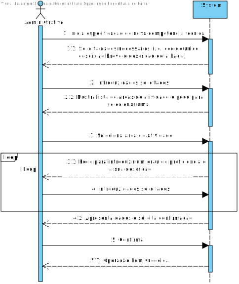
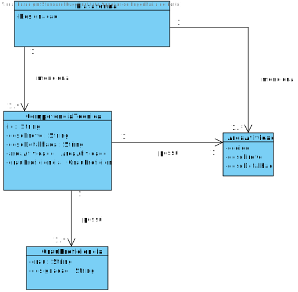
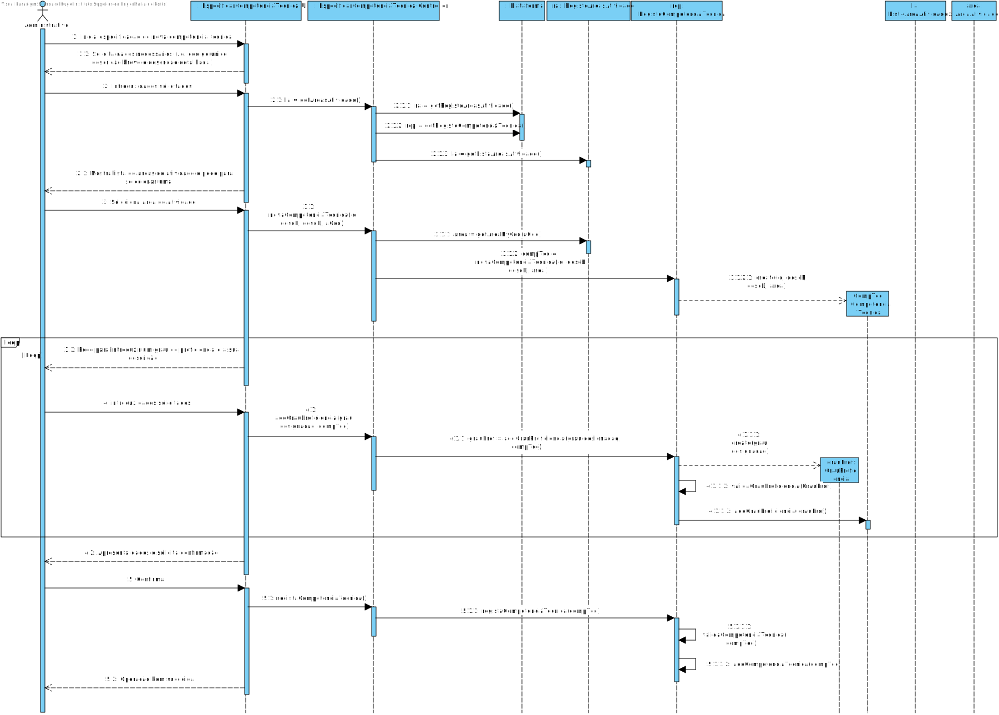
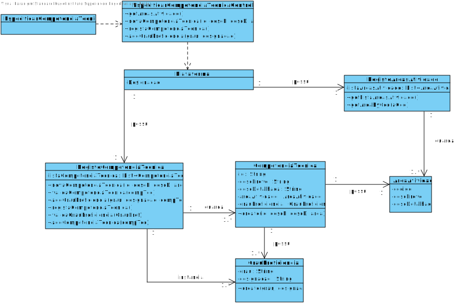

# UC4 - Especificar Competência Técnica

## 1. Engenharia de Requisitos

### Formato Breve

O administrativo inicia a especificação de uma nova competência técnica. O sistema solicita os dados necessários (i.e. código único, descrição breve e descrição detalhada). O administrativo introduz os dados solicitados. O sistema mostra a lista de áreas de atividade e pede para selecionar uma. O administrativo seleciona uma área de atividade. O sistema pede para introduzir um grau de proficiência e a sua descrição. O administrativo insere os dados solicitados. O sistema apresenta os dados e solicita confirmação. O administrativo confirma. O sistema regista os dados e informa o administrativo do sucesso da operação.

### SSD

### Formato Completo

#### Ator principal

Administrativo

#### Partes interessadas e seus interesses
* **Administrativo:** pretende especificar as competências técnicas de modo a posteriormente atribui-las para a realização de tarefas.
* **T4J:** pretende que a plataforma contenha a especificação das competências técnicas de modo a estas serem atribuídas a tarefas, aumentando a qualidade das tarefas desenvolvidas.

#### Pré-condições
n/a

#### Pós-condições
A informação da competência técnica é registada no sistema.

### Cenário de sucesso principal (ou fluxo básico)

1. O administrativo inicia a especificação de uma nova competência técnica.
2. O sistema solicita os dados necessários (i.e. código único, descrição breve e descrição detalhada).
3. O administrativo introduz os dados solicitados.
4. O sistema mostra a lista de áreas de atividade e pede para selecionar uma.
5. O administrativo seleciona uma área de atividade.
6. O sistema pede para introduzir um grau de proficiência e a sua descrição.
7. O administrativo introduz os dados solicitados.
8. O sistema apresenta os dados e solicita confirmação.
9. O administrativo confirma.
10. O sistema regista os dados e informa o administrativo do sucesso da operação.

- Nota: Os passos 6 e 7 repetem-se num loop.
#### Extensões (ou fluxos alternativos)

*a. O administrativo solicita o cancelamento da especificação da competência técnica.

> O caso de uso termina.

2a. Dados mínimos obrigatórios em falta.
>	1. O sistema informa quais os dados em falta.
>	2. O sistema permite a introdução dos dados em falta (passo 3)
>
	>	2a. O administrativo não altera os dados. O caso de uso termina.

2b. O sistema deteta que os dados (ou algum subconjunto dos dados) introduzidos devem ser únicos e que já existem no sistema.
>	1. O sistema alerta o administrativo para o facto.
>	2. O sistema permite a sua alteração (passo 3)
>
	>	2a. O administrativo não altera os dados. O caso de uso termina.

2c. O sistema deteta que os dados introduzidos (ou algum subconjunto dos dados) são inválidos.
> 1. O sistema alerta o administrativo para o facto.
> 2. O sistema permite a sua alteração (passo 3).
>
	> 2a. O administrativo não altera os dados. O caso de uso termina.

4a. O sistema não contém nenhuma área de atividade disponível.
> O caso de uso termina.

#### Requisitos especiais
\-

#### Lista de Variações de Tecnologias e Dados
\-

#### Frequência de Ocorrência
\-

#### Questões em aberto

* Existem outros dados que são necessários?
* Todos os dados são obrigatórios?
* O código único é sempre introduzido pelo administrativo ou o sistema deve gerá-lo automaticamente?
* Qual a frequência de ocorrência deste caso de uso?
* Uma competência técnica pode estar associada a mais do que uma área de atividade?
* É necessário fazer alguma verificação especifica aos graus de proficiência?

## 2. Análise OO

### Excerto do Modelo de Domínio Relevante para o UC

## 3. Design - Realização do Caso de Uso

### Racional

| Fluxo Principal | Questão: Que Classe... | Resposta  | Justificação  |
|:--------------  |:---------------------- |:----------|:---------------------------- |
| 1. O administrativo inicia a especificação de uma nova competência técnica.   		 |	... interage com o utilizador? | EspecificarCompetenciaTecnicaUI    |  Pure Fabrication, pois não se justifica atribuir esta responsabilidade a nenhuma classe existe no Modelo de Domínio. |
|  		 |	... coordena o UC?	| EspecificarCompetenciaTecnicaController | Controller    |
|  		 |	... cria instância de CompetenciaTecnica? | RegistoCompetenciaTecnica   | HC+LC   |
| 2. O sistema solicita os dados necessários (i.e. código único, descrição breve e descrição detalhada).  		 | |  | |
| 3. O administrativo introduz os dados solicitados.  		 |	... guarda os dados introduzidos?  |   CompetenciaTecnica | Information Expert (IE) - instância criada no passo 1     |
| 4. O sistema mostra a lista de áreas de atividade e pede para selecionar uma.   		 |	...conhece as AreaAtividade existentes a listar? | RegistoAreasAtividade |  HC+LC|  
| 5. O administrativo seleciona uma área de atividade.   		 | ...guarda a AreaAtividade?		 |  CompetenciaTecnica           |  IE: CompetenciaTecnica catalogado numa AreaAtividade - instância criada no passo 1                            |
|6. O sistema pede para introduzir um grau de proficiência e a sua descrição|||
|7. O administrativo introduz os dados solicitados|...cria instância de GrauProficiência|RegistoCompetenciaTecnica|HC+LC|
||...guarda o GrauProficiência|CompenteciaTecnica|IE - instância criada no passo 1
| 8.  O sistema apresenta os dados e solicita confirmação.  		 | ...valida os dados da CompetenciaTecnica(validação local)? | CompetenciaTecnica  | IE: CompetenciaTecnica possui os seus próprios dados|
|| ...valida os dados da CompetenciaTecnica (validação global)?| RegistoCompetenciaTecnica | HC+LC||
| 9.  O administrativo confirma.  		 | |   | |
| 10. O sistema regista os dados e informa o administrativo do sucesso da operação. |  ...guarda a CompetenciaTecnica especificada/criada?| RegistoCompetenciaTecnica | HC+LC |
|| ... notifica o utilizador? | EspecificarCompetenciaTecnicaUI    ||

### Sistematização ##

 Do racional resulta que as classes conceptuais promovidas a classes de software são:

 * Plataforma
 * AreaAtividade
 * CompetenciaTecnica

Outras classes de software (i.e. Pure Fabrication e HC+LC) identificadas:  

 * EspecificarCompetenciaTecnicaUI  
 * EspecificarCompetenciaTecnicaController
 * RegistoAreasAtividade
 * RegistoCompetenciaTecnica

###	Diagrama de Sequência

###	Diagrama de Classes

