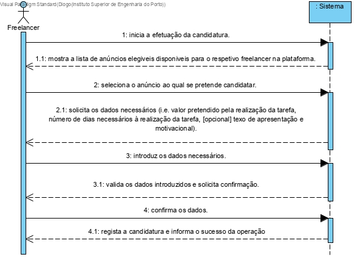
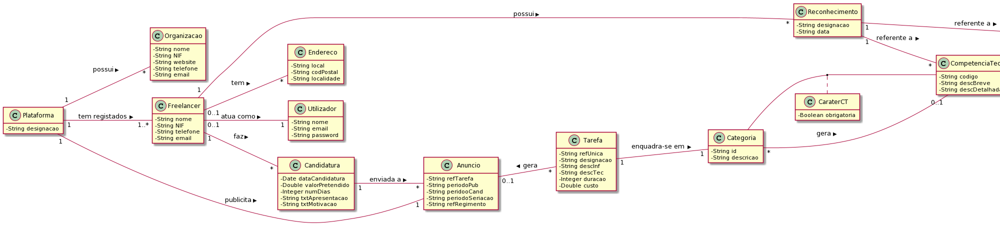
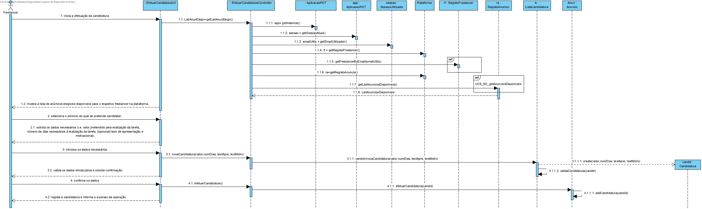

# UC9 - EfetuarCandidatura

## Formato Breve

O freelancer inicia a efetuação da candidatura. O sistema mostra a lista de anúncios elegiveis disponiveis para o respetivo freelancer na plataforma. O freelancer seleciona o anúncio ao qual se pretende candidatar.  O sistema solicita os dados necessários (i.e. valor pretendido pela realização da tarefa, número de dias necessários à realização da tarefa, [opcional] texo de apresentação e motivacional). O freelancer introduz os dados necessários. O sistema valida os dados introduzidos e solicita confirmação. O freelancer confirma os dados . O sistema regista a candidatura e informa o sucesso da operação.

## SSD

## Formato Completo

### Ator principal

Freelancer

### Partes interessadas e seus interesses

* **Freelancers**: Pretende efetuar a candidatura de forma a ser escolhido para fazer uma determinada tarefa.
* **T4J**: Pretende que a plataforma permita guardar todas as candidaturas efetuadas.
* **Tarefa**: Pretende que os freelancers se candidatem aos seus anúncios.

### Pré-condições

Deve haver anúncios para efetuar candidatura.
O freelancer deve estar corretamente registado.

### Pós-condições

As candidaturas dos freelancers são registadas no sistema.

## Cenário de sucesso principal (ou fluxo básico)

1. O freelancer inicia a efetuação da candidatura.
2. O sistema mostra a lista de anúncios elegiveis disponiveis para o respetivo freelancer na plataforma.
3. O freelancer seleciona o anúncio ao qual se pretende candidatar.
4. O sistema solicita os dados necessários (i.e. valor pretendido pela realização da tarefa, número de dias necessários à realização da tarefa, [opcional] texo de apresentação e motivacional).
5. O freelancer introduz os dados necessários.
6. O sistema valida os dados introduzidos e solicita confirmação
7. O freelancer confirma os dados.
8. O sistema regista a candidatura e informa o sucesso da operação.

### Extensões (ou fluxos alternativos)

*a. O freelancer solicita o cancelamento da candidatura.
> O caso de uso termina.

*2a. O sistema deteta que a lista de anuncios está vazia.
> O caso de uso termina.

*2b. O sistema não deteta os grau minimos necessários do freelancer.
> O caso de uso termina.

*3a. O freelancer não tem acesso aos anúncios
> O caso de uso termina.

6a. Dados mínimos obrigatórios em falta.
>	1. O sistema informa quais os dados em falta.
>	2. O sistema permite a introdução dos dados em falta (passo 4).
>
	>	2a. O freelancer não altera os dados. O caso de uso termina.

6b. O sistema deteta que os dados (ou algum subconjunto dos dados) introduzidos devem ser únicos e que já existem no sistema.
>	1. O sistema alerta o freelancer para o facto.
>	2. O sistema permite a sua alteração (passo 4).
>
	>	2a. O freelancer não altera os dados. O caso de uso termina.

6c. O sistema deteta que os dados introduzidos (ou algum subconjunto dos dados) são inválidos.
> 1. O sistema alerta o freelancer para o facto.
> 2. O sistema permite a sua alteração (passo 4).
>
	> 2a. O freelancer não altera os dados. O caso de uso termina.

7a. O freelancer não confirma.
> O sistema permite a alteração dos dados.

### Requisitos especiais
-

### Lista de Variações de Tecnologias e Dados
-

### Frequência de Ocorrência
-

### Questões em aberto

* Pode haver mais que 1 freelancer a candidatar-se ao mesmo anúncio?
* Pode o sistema negociar o valor e o numero de dias proposto pelo freelancer?
* Qual a frequência de ocorrência deste caso de uso?
* Haverá mais dados necessários?
* Poderá o freelancer candidatar-se a vários anúncios?

## 2. Análise OO

### Excerto do Modelo de Domínio Relevante para o UC

## 3. Design - Realização do Caso de Uso

### Racional

| Fluxo Principal | Questão: Que Classe... | Resposta  | Justificação  |
|:--------------  |:---------------------- |:----------|:---------------------------- |
| 1. O freelancer inicia a efetuação da candidatura.	 |	... interage com o utilizador? | EfetuarCandidaturaUI   |  Pure Fabrication, pois não se justifica atribuir esta responsabilidade a nenhuma classe existente no Modelo de Domínio. |
|  		 |	... coordena o UC?	| EfetuarCandidaturaController | Controller    |
|  		 |	... cria instância Candidatura? | Anuncio | Creator (Regra1)   |
|  		 |	... conhece o freelancer que inicia a candidatura?	| SessaoUtilizador | IE: IE: documentação do componente de gestão de utilizadores. |
| 2. O sistema mostra a lista de anúncios elegiveis disponiveis para o respetivo freelancer na plataforma.		 |filtra os anúncios apenas com as tarefas que são elegiveis para o freelancer?  |  Plataforma | IE: a plataforma possui o RegistoAnuncio|
||...tem conhecimento de todos anuncios  existentes?|RegistoAnuncios|HC/LC| 
||...tem conhecimento da tarefa?|Anuncio|IE: conhece a tarefa|
|||Tarefa|IE: possui categoria de tarefa|
|||Categoria|IE: tem associada as competencias tecnicas e os seus caráter|
|||CompetenciaTecnica|IE: tem associada um grau de proficiencia|
3. O freelancer seleciona o anúncio ao qual se pretende candidatar.	  | |
| 4. O sistema solicita os dados necessários (i.e. valor pretendido pela realização da tarefa, número de dias necessários à realização da tarefa, [opcional] texo de apresentação e motivacional).
| 5. O freelancer introduz os dados necessários.	 |  ...guarda os dados introduzidos?  | Candidatura   | IE: instancia criada no passo 1     |                  
| 6.  O sistema valida os dados introduzidos e solicita confirmação	 | ...valida os dados da Candidatura(validação local)? | Candidatura| IE: A candidatura possui os seus proprios dados |
||...valida os dados da Candidatura(validação global)?|ListaCandidatura|HC/LC|
| 7. O freelancer confirma os dados.	 |		
| 8. O sistema regista a candidatura e informa o sucesso da operação.| ...guarda a candidatura criada?|  ListaCandidatura |  HC/LC                    |

## Sistematização ##

 Do racional resulta que as classes conceptuais promovidas a classes de software são:
 
* ListaCandidatura
* Anuncio
* Plataforma
* RegistoAnuncios
* Tarefa
* Categoria
* CompetenciaTecnica
* Candidatura

Outras classes de software (i.e. Pure Fabrication) identificadas:

* EfetuarCandidaturaUI
* EfetuarCandidaturaController
 
Outras classes de sistemas/componentes externos:

* SessaoUtilizador

## Diagrama de Sequência ##

## Diagrama de Classes ##

