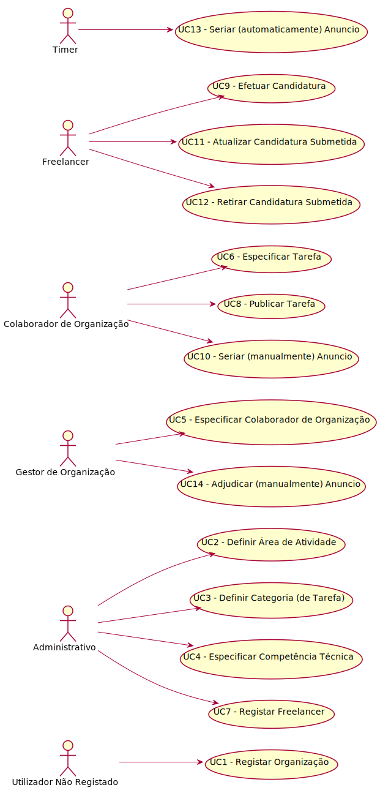

# Diagrama de Casos de Uso

**Para cada caso de uso deve ser realizada a sua descrição (perspetiva de engenharia de requisitos) e a sua realização (perspetiva de design).**

# Casos de Uso
| UC  | Descrição                                                               |                   
|:----|:------------------------------------------------------------------------|
| UC1 | [Registar Organização](UC1_RegistarOrganizacao.md)   |
| UC2 | [Definir Área de Atividade](UC2_DefinirArea.md)  |
| UC3 | [Definir Categoria (de Tarefa)](UC3_DefinirCategoria.md)|
| UC4 | [Especificar Competência Técnica](UC4_EspecificarCT.md)|
| UC5 | [Especificar Colaborador de Organização](UC5_EspecificarColaborador.md) |
| UC6 | [Especificar Tarefa](UC6_EspecificarTarefa.md)|~
| UC7 | [Registar Freelancer](UC7_RegistarFreelancer.md)|
| UC8 | [Publicar Tarefa](UC8_PublicarTarefa.md)|
| UC9 | [Efetuar Candidatura](UC9_EfetuarCandidatura.md) |
| UC10 | [Seriar (manualmente) Anuncio](UC10_SeriarAnuncio.md)|
| UC11 | [Atualizar Candidatura Submitida](UC11_AtualizarCandidaturaSubmetida.md)|
| UC12 | [Remover Candidatura](UC12_Retirar_Candidatura_Submetida.md)|
| UC13 | [Seriar (automaticamente) Anuncio](UC13_SeriarAutomaticamenteAnuncio.md)|
| UC14 | [Adjudicar (manualmente) Anuncio](UC14_AdjudicarAnuncioManualmente.md)|