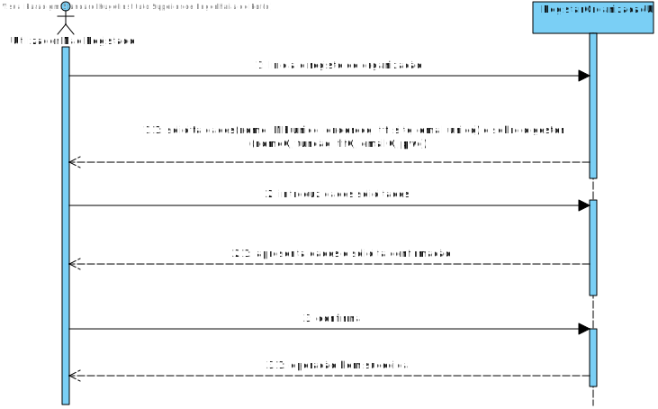
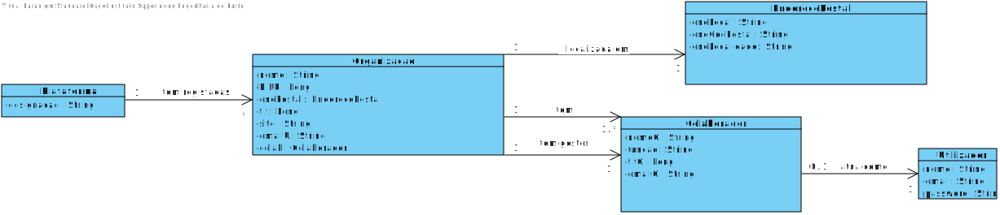
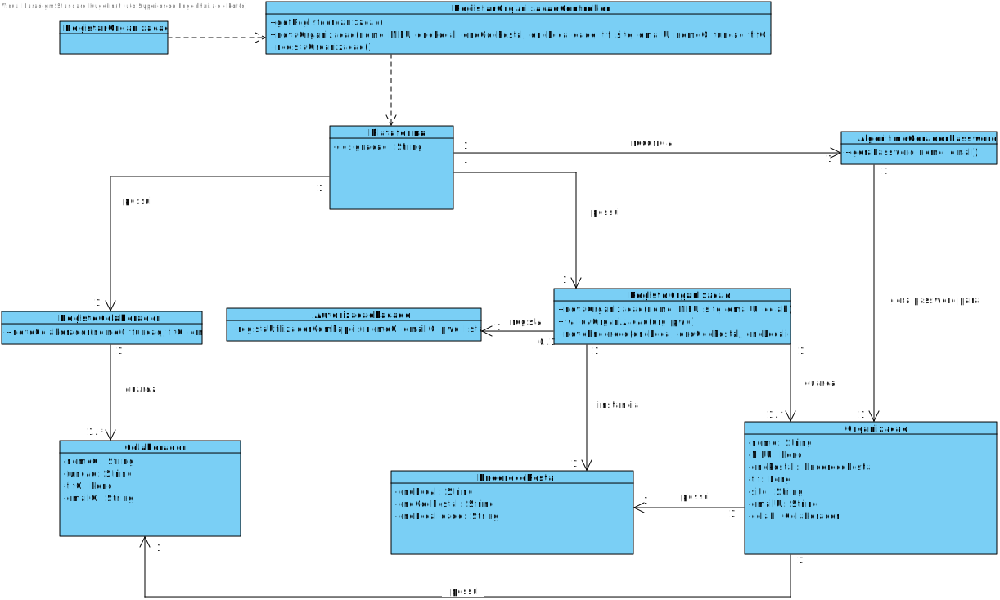

# UC1 - Registar Organização

## 1. Engenharia de Requisitos

### Formato Breve

O utilizador não registado inicia o registo de uma organização. O sistema solicita os dados necessários sobre a organização (i.e. nome da organização, o NIF único, o endereço postal, um contacto telefónico, o endereço web, email único) e sobre o colaborador (i.e. gestor) que está a proceder ao registo (i.e. nome, função, contacto telefónico, email e pwd). O utilizador não registado introduz os dados solicitados. O sistema valida e apresenta os dados, pedindo que os confirme. O utilizador não registado confirma. O sistema **regista os dados da organização e  do seu colaborador/gestor, tornando este último um utilizador registado** e informa o utilizador não registado do sucesso da operação.

### SSD

### Formato Completo

#### Ator principal

Utilizador Não Registado

#### Partes interessadas e seus interesses
* **Utilizador Não Registado:** pretende regista a organização a que pertence para que possa usufruir das funcionalidade disponibilizadas pela plataforma.
* **T4J:** pretende que a organização em causa se registe de modo usar a plataforma.

#### Pré-condições
n/a

#### Pós-condições
A informação do registo é guardada no sistema.

#### Cenário de sucesso principal (ou fluxo básico)

1. O utilizador não registado inicia o registo de uma organização.
2. O sistema solicita os dados necessários sobre a organização (i.e. nome da organização, o NIF único, o endereço postal, um contacto telefónico, o endereço web, email único) e sobre o colaborador (i.e. gestor) que está a proceder ao registo (i.e. nome, função, contacto telefónico, email e pwd).
3. O utilizador não registado introduz os dados solicitados.
4. O sistema valida e apresenta os dados, pedindo que os confirme.
5. O utilizador não registado confirma.
6. O sistema **regista os dados da organização e  do seu colaborador/gestor, tornando este último um utilizador registado** e informa o utilizador não registado do sucesso da operação.

#### Extensões (ou fluxos alternativos)

*a. O utilizador não registado solicita o cancelamento da registo.

> O caso de uso termina.

4a. Dados de Endereço Postal incompletos.
>	1. O sistema informa quais os dados em falta.
>	2. O sistema permite a introdução dos dados em falta (passo 3)
>
	>	2a. O utilizador não registado não altera os dados. O caso de uso termina.

4b. Dados mínimos obrigatórios em falta.
>	1. O sistema informa quais os dados em falta.
>	2. O sistema permite a introdução dos dados em falta (passo 3)
>
	>	2a. O utilizador não registado não altera os dados. O caso de uso termina.

4c. O sistema deteta que os dados (ou algum subconjunto dos dados) introduzidos devem ser únicos e que já existem no sistema.
>	1. O sistema alerta o utilizador não registado para o facto.
>	2. O sistema permite a sua alteração (passo 3)
>
	>	2a. O utilizador não registado não altera os dados. O caso de uso termina.

#### Requisitos especiais
\-

#### Lista de Variações de Tecnologias e Dados
\-

#### Frequência de Ocorrência
\-

#### Questões em aberto

* Existem outros dados obrigatórios para além dos já conhecidos?
* Existem outros atributos que necessitam de ser únicos?
* É necessário existir algum mecanismo de segurança adicional para confirmar que a organização existe e é representada pela pessoa que a registou?
* Quais são as regras de segurança aplicaveis à palavra-passe?
* Qual a frequência de ocorrência deste caso de uso?

## 2. Análise OO

### Excerto do Modelo de Domínio Relevante para o UC

## 3. Design - Realização do Caso de Uso

### Racional

| Fluxo Principal | Questão: Que Classe... | Resposta  | Justificação  |
|:--------------  |:---------------------- |:----------|:---------------------------- |
|1. O utilizador não registado inicia o registo de uma organização.|... interage com o utilizador?| RegistarOrganizacaoUI |Pure Fabrication|
| |... coordena o UC?| RegistarOrganizacaoController |Controller|
|2. O sistema solicita os dados necessários sobre a organização (i.e. nome da organização, o NIF, o endereço postal, um contacto telefónico, o endereço web, email) e sobre o colaborador (i.e. gestor) que está a proceder ao registo (i.e. nome, função, contacto telefónico, email e pwd).||||
|3. O utilizador não registado introduz os dados solicitados.  |... cria instâncias de EnderecoPostal?|EnderecoPostal|creator(regra1)|
| |... cria instâncias de Colaborador?|Colaborador|creator(regra1)|
| |... cria instâncias de Organizacao?|Organizacao|creator(regra1)|
| |... guarda instâncias de Organizacao?|RegistoOrganizacao|HC+LC|
| |... guarda instâncias de Colaborador?|RegistoColaborador|HC+LC|
|4. O sistema valida e apresenta os dados, pedindo que os confirme. |... valida os dados da Organizacao (validação local)|Organizacao|IE: possui os seus próprios dados|
| |... valida os dados da Organizacao (validação global)|RegistoOrganizacao|IE + HC/LC: O RegistoOrganizacao tem registadas Organizacao|
|5. O utilizador não registado confirma. ||||
|6. O sistema **regista os dados da organização e  do seu colaborador/gestor, tornando este último um utilizador registado** e informa o utilizador não registado do sucesso da operação.|... guarda a Organizacao criada?| RegistoOrganizacao |IE + HC/LC: O RegistoOrganizacao guarda Organizacao|
| |... regista/guarda o Utilizador referente ao Colaborador da Organizacao?|AutorizacaoFacade|IE. A gestão de utilizadores é responsabilidade do componente externo respetivo cujo ponto de interação é através da classe "AutorizacaoFacade"|

### Sistematização ##

 Do racional resulta que as classes conceptuais promovidas a classes de software são:

 * Plataforma
 * Organizacao
 * Colaborador
 * EnderecoPostal

Outras classes de software (i.e. Pure Fabrication e HC/LC) identificadas:  

 * RegistarOrganizacaoUI  
 * RegistarOrganizacaoController
 * RegistoOrganizacao
 * RegistoColaborador

###	Diagrama de Sequência

###	Diagrama de Classes

