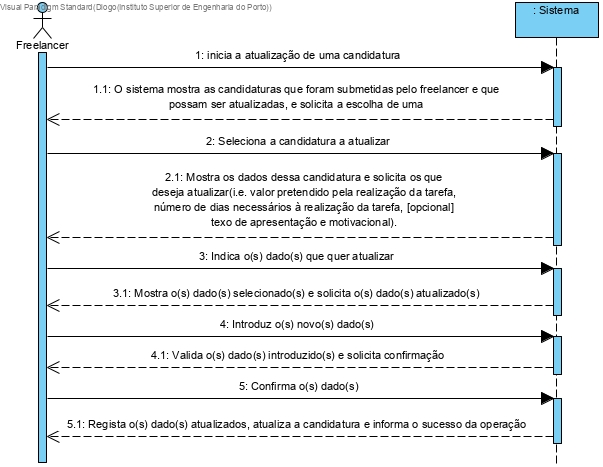
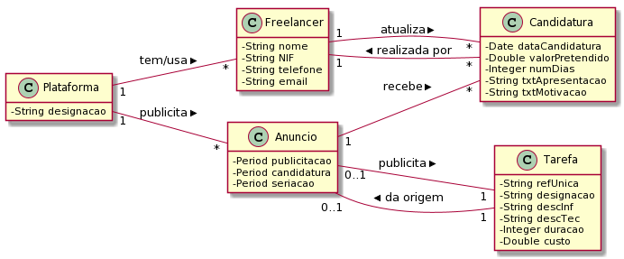
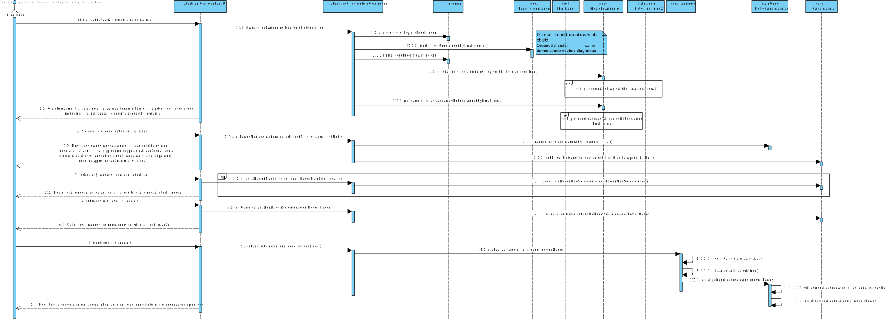
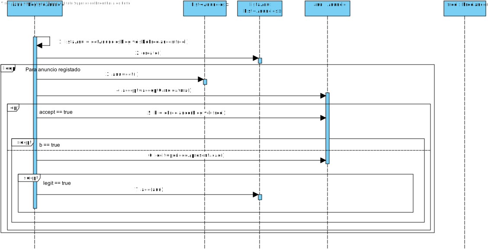
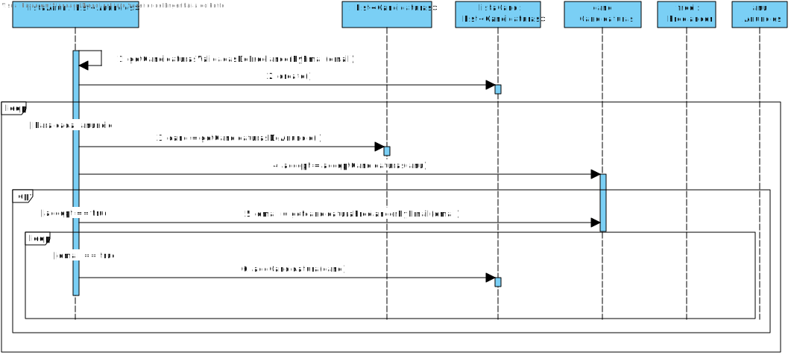
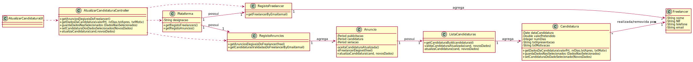

# UC11 - AtualizarCandidaturaSubmetida

## Formato Breve

O freelancer inicia a atualização de uma candidatura. O sistema mostra as candidaturas que foram submetidas pelo freelancer e que possam ser atualizadas, e solicita a escolha de uma.O freelancer seleciona a candidatura a atualizar. O sistema mostra os dados dessa candidatura e solicita os que deseja atualizar(i.e. valor pretendido pela realização da tarefa, número de dias necessários à realização da tarefa, [opcional] texo de apresentação e motivacional). O freelancer indica o(s) dado(s) que quer atualizar. O sistema mostra o(s) dado(s) selecionado(s) e solicita o(s) dado(s) atualizado(s). O freelancer introduz o(s) novo(s) dado(s). O sistema Valida o(s) dado(s) introduzido(s) e solicita confirmação. O  freelancer confirma o(s) dado(s). O sistema regista o(s) dado(s) atualizados, atualiza a candidatura e informa o sucesso da operação. 

## SSD

## Formato Completo

### Ator principal

Freelancer

### Partes interessadas e seus interesses

* **Colaborador de Organização**: pretende receber as Candidaturas atualizadas aos respetivos Anúncios publicados.
* **Organização**: pretende receber as Candidaturas atualizadas para as respetivas Tarefas publicadas para execução por Freelancers.
* **Freelancer**: pretende apresentar a sua Candidatura atualizada.
* **T4J**: pretende receber as Candidaturas atualizadas para posterior atribuição correta das tarefas a Freelancers.

### Pré-condições

A Candidatura deve já ter sido submetida a um anúncio.

### Pós-condições

É registada a Candidatura atualizada ao respetivo Anúncio.

## Cenário de sucesso principal (ou fluxo básico)

1. O freelancer inicia a atualização de uma candidatura.
2. O sistema mostra as candidaturas que foram submetidas pelo freelancer e que possam ser atualizadas, e solicita a escolha de uma.
3. O freelancer seleciona a candidatura a atualizar.
4. O sistema mostra os dados dessa candidatura e solicita os que deseja atualizar(i.e. valor pretendido pela realização da tarefa, número de dias necessários à realização da tarefa, [opcional] texo de apresentação e motivacional).
5. O freelancer indica o(s) dado(s) que quer atualizar.
6. O sistema mostra o(s) dado(s) selecionado(s) e solicita o(s) dado(s) atualizado(s).
7. O freelancer introduz o(s) novo(s) dado(s).
8. O sistema Valida o(s) dado(s) introduzido(s) e solicita confirmação.
9. O  freelancer confirma o(s) dado(s).
10. O sistema regista o(s) dado(s) atualizados, atualiza a candidatura e informa o sucesso da operação. 

### Extensões (ou fluxos alternativos)

*a. O freelancer solicita o cancelamento da atualização candidatura.
> O caso de uso termina.

*2a. O sistema deteta que a lista de candidaturas está vazia.
> O caso de uso termina.

*2b. O sistema deteta que as candidaturas do freelancer já não podem ser atualizadas.
> O caso de uso termina.

*4a. O sistema não deteta os dados da candidatura.
> O caso de uso termina.

8a. Dados mínimos obrigatórios em falta.
>	1. O sistema informa quais os dados em falta.
>	2. O sistema permite a introdução dos dados em falta (passo 7).
>
	>	2a. O freelancer não altera os dados. O caso de uso termina.

8b. O sistema deteta que os dados (ou algum subconjunto dos dados) introduzidos devem ser únicos e que já existem no sistema.
>	1. O sistema alerta o freelancer para o facto.
>	2. O sistema permite a sua alteração (passo 7).
>
	>	2a. O freelancer não altera os dados. O caso de uso termina.

8c. O sistema deteta que os dados introduzidos (ou algum subconjunto dos dados) são inválidos.
> 1. O sistema alerta o freelancer para o facto.
> 2. O sistema permite a sua alteração (passo 7).
>
	> 2a. O freelancer não altera os dados. O caso de uso termina.

9a. O freelancer não confirma.
> O sistema permite a alteração dos dados.

### Requisitos especiais
-

### Lista de Variações de Tecnologias e Dados
-

### Frequência de Ocorrência
-

### Questões em aberto

* Poderá um freelancer atualizar a mesma candidatura mais que uma vez?
* Os dados antigos da candidatura, que foi atualizada, ficarão guardados no sistema?
* Qual a frequência de ocorrência deste caso de uso?
* Haverá mais dados necessários?
* Haverá um limite de atuallizações por cada freelancer?

## 2. Análise OO

### Excerto do Modelo de Domínio Relevante para o UC

## 3. Design - Realização do Caso de Uso

### Racional

| Fluxo Principal | Questão: Que Classe... | Resposta  | Justificação  |
|:--------------  |:---------------------- |:----------|:---------------------------- |
| 1. O freelancer inicia a atualização de uma candidatura.	 |	... interage com o utilizador? | AtualizarCandidaturaUI|  Pure Fabrication |
|  		 |	... coordena o UC?	| AtualizarCandidaturaController| Controller    |
|  		 |	... atualiza a instância Candidatura? | Anuncio | IE: O Anúncio guarda a informação das suas Candidaturas Atualizadas.    | 
|  		 || ListaCandidaturas | IE: no MD o Anúncio recebe Candidaturas. Por aplicação de HC+LC delega a ListaCandidaturas   | 
|  		 |	  ...conhece o utilizador/Freelancer a usar o sistema?	| SessaoUtilizador | IE: documentação do componente de gestão de utilizadores. |
|  		 |	 ...conhece o Freelancer ?	|   Plataforma| conhece todos os Freelancers |
|  		 |	 	|   RegistoFreelancer|   Por aplicação de HC+LC delega a RegistoFreelancer |
| 2. O sistema mostra as candidaturas que foram submetidas pelo freelancer e que possam ser atualizadas, e solicita a escolha de uma.		 |... conhece as anuncios?  |  Plataforma | IE: no MD a Plataforma possui Anúncios.|
|||RegistoAnuncios|IE: no MD a Plataforma possui Anuncios. Por aplicação de HC+LC delega a RegistoAnuncios| 
||conhece as Candidaturas?|Anuncio|IE: no MD a Plataforma possui Candidaturas.|
|||ListaCandidaturas|Por aplicação de HC+LC delega a ListaCandidaturas|
||  ...conhece as Candidaturas válidas para atualização?|Anuncio|O Anuncio conhece os seus dados|
||  ...conhece o autor da candidatura?|Candidatura|A candidatura conhece os seus dados|
3. O freelancer seleciona a candidatura a atualizar.	  | |
| 4. O sistema mostra os dados dessa candidatura e solicita os que deseja atualizar(i.e. valor pretendido pela realização da tarefa, número de dias necessários à realização da tarefa, [opcional] texo de apresentação e motivacional). |  ...conheces os dados da candidatura?  | Candidatura   | A candidatura conhece os seus dados     |                  
| 5. O freelancer indica o(s) dado(s) que quer atualizar.	 |  ...guarda os dados não introduzidos?  | Anúncio| No MD Anúncio recebe Candidaturas    |                  
| | |       ListaCandidaturas        |    Por aplicação de HC+LC delega a ListaCandidaturas    | 
| | |       Candidatura|    IE: Candidatura conhece os seus dados   |           
| 6.  O sistema mostra o(s) dado(s) selecionado(s) e solicita o(s) dado(s) atualizado(s).	
| 7.  O freelancer introduz o(s) novo(s) dado(s).	 |	  ...guarda os dados introduzidos?  | Anúncio| No MD Anúncio recebe Candidaturas    |                  
| | |       ListaCandidaturas        |    Por aplicação de HC+LC delega a ListaCandidaturas    | 
| | |       Candidatura|    IE: Candidatura conhece os seus dados   | 	
| 8. O sistema Valida o(s) dado(s) introduzido(s) e solicita confirmação.|   ...valida os dados da Candidatura Atualizada(validação local)? | Candidatura| IE: A candidatura possui os seus proprios dados |
||...valida os dados da Candidatura Atualizada(validação global)?|ListaCandidatura|IE: no MD o Anúncio recebe Candidaturas. Por aplicação de HC+LC delega a ListaCandidaturas|   
| 9. O  freelancer confirma o(s) dado(s).	 |		
| 10. O sistema regista o(s) dado(s) atualizados, atualiza a candidatura e informa o sucesso da operação. | ...atualiza a candidatura?|  Anúncio|    IE: no MD o Anúncio recebe Candidaturas.                  |               | 
|    | | ListaCandidaturas| IE: no MD o Anúncio recebe Candidaturas. Por aplicação de HC+LC delega a ListaCandidaturas|
|    |   ... informa o Freelancer do sucesso?| AtualizarCandidaturaUI| |

### Sistematização

Do racional resulta que as classes conceptuais promovidas a classes de software são:

-   Plataforma
-   Candidatura
-   Freelancer
-   Anúncio

Outras classes de software (i.e. Pure Fabrication) identificadas:

-   AtualizarCandidaturaUI
-    AtualizarCandidaturaController
-   RegistoFreelancer
-   RegistoAnuncios
-   ListaCandidaturas

Outras classes de sistemas/componentes externos:

-   SessaoUtilizador

## Diagrama de Sequência ##

## Diagrama de Classes ##

