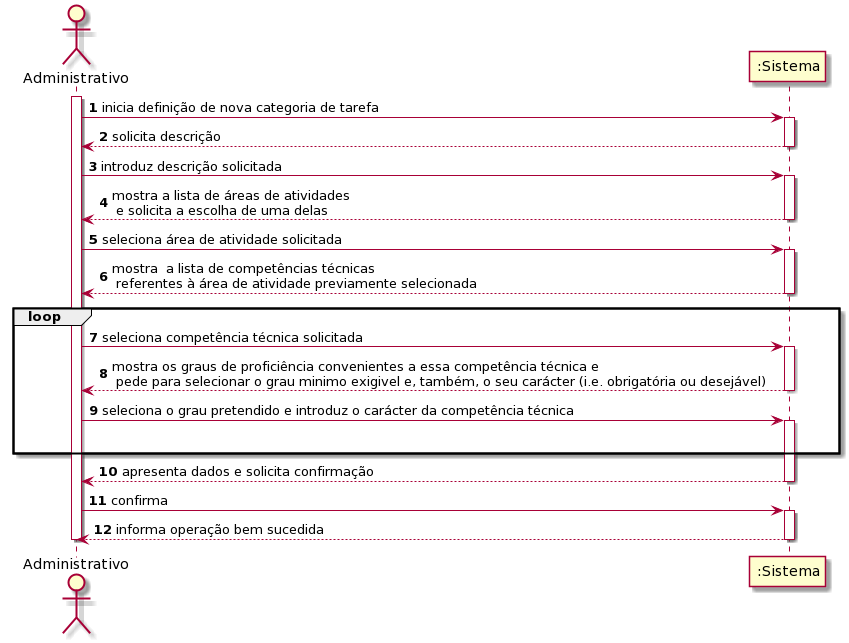
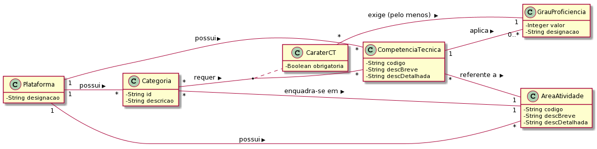
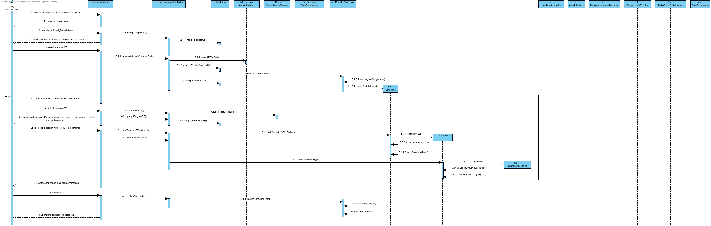
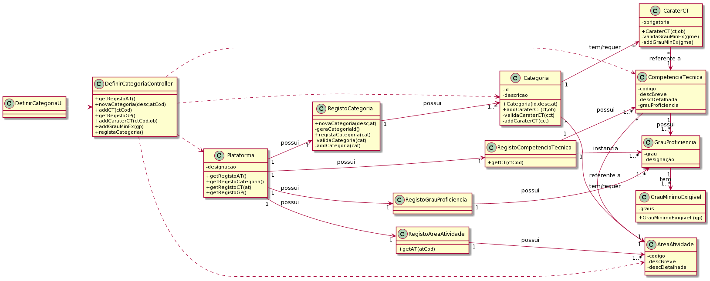

# UC3 - Definir Categoria de Tarefa

## 1. Engenharia de Requisitos

### Formato Breve

O administrativo inicia a definição de uma nova categoria de tarefa. O sistema solicita os dados necessários (i.e. descrição, área de atividade ,lista de competências técnicas requeridas, os graus de proficiência convenientes a essa competência técnica e pede para selecionar o grau minimo exigivel e, também, o seu carácter). O administrativo introduz os dados solicitados. O sistema valida e apresenta os dados ao administrativo, pedindo que os confirme. O administrativo confirma. O sistema regista os dados e informa o administrativo do sucesso da operação.

### SSD

### Formato Completo

#### Ator principal

Administrativo

#### Partes interessadas e seus interesses
* **Administrativo:** pretende definir as categorias de tarefas para que estas possam ser usadas posteriormente na especificação de tarefas.
* **Colaborador:** pretende que as categorias estejam definidas para poder especificar corretamente as suas tarefas.
* **T4J:** pretende que a plataforma permita associar as categorias de tarefas às áreas de atividades e às tarefas.

#### Pré-condições
n/a

#### Pós-condições
A informação da categoria da tarefa é registada no sistema.

### Cenário de sucesso principal (ou fluxo básico)

1. O administrativo inicia a definição de uma nova categoria de tarefa.
2. O sistema solicita a descrição.
3. O administrativo introduz a descrição.
4. O sistema mostra a lista de áreas de atividades para que seja selecionada uma.
5. O administrativo seleciona uma área de atividade.
6. O sistema mostra a **lista de competências técnicas referentes à área de atividade previamente selecionada** para que seja selecionada uma.
7. O administrativo escolhe uma competência técnica da lista.
8. O sistema mostra os graus de proficiência convenientes a essa competência técnica e \n pede para selecionar o grau minimo exigivel e, também, o seu carácter (i.e. obrigatória ou desejável).
9. O administrativo seleciona o grau pretendido e introduz o carácter da competência técnica.
10. **Os passos 7 a 11 repetem-se enquanto não forem introduzidas todas as competências técnicas pretendidas.**
11. O sistema valida e apresenta os dados ao administrativo, pedindo que os confirme.
12. O administrativo confirma.
13. O sistema regista os dados e informa o administrativo do sucesso da operação.

#### Extensões (ou fluxos alternativos)

*a. O administrativo solicita o cancelamento da definição da categoria de tarefa.

> O caso de uso termina.

4a. O sistema deteta que a lista de áreas de atividades está vazia.
>1. O sistema informa o administrativo de tal facto.  
>2. O sistema permite a definição de uma nova área de atividade (UC2).  
> 2a. O administrativo não define uma área de atividade. O caso de uso termina.

5a. O administrativo não encontra a área de atividade pretendida.
>1. O administrativo informa o sistema de tal facto.  
>2. O sistema permite a definição de uma nova área de atividade (UC2).  
> 2a. O administrativo não define uma área de atividade. O caso de uso termina.

6a. O sistema deteta que a lista de competências técnicas está vazia.
>1. O sistema informa o administrativo de tal facto.  
>2. O sistema permite a especificação de uma nova competência técnica (UC4).  
> 2a. O administrativo não especifica uma competência técnica. O caso de uso termina.

7a. O administrativo não encontra a competência técnica pretendida.
>1. O administrativo informa o sistema de tal facto.  
>2. O sistema permite a especificação de uma nova competência técnica (UC4).  
> 2a. O administrativo não especifica uma competência técnica. O caso de uso termina.

8a. O sistema deteta que os graus de proficiência convenientes a essa competência técnica não existem.
>1. O sistema informa o administrativo de tal facto.  
>2. O sistema permite a especificação de um novo grau de proficiência (UC4).  
> 2a. O administrativo não especifica um grau de proficiência. O caso de uso termina.

9a. O administrativo não encontra os graus de proficiência convenientes a essa competência técnica.
>1. O administrativo informa o sistema de tal facto.  
>2. O sistema permite a especificação de um novo grau de proficiência (UC4).  
> 2a. O administrativo não especifica um grau de proficiência. O caso de uso termina.

11a. Dados mínimos obrigatórios em falta.
>	1. O sistema informa quais os dados em falta.
>	2. O sistema permite a introdução dos dados em falta (passo 3).
>
	>	2a. O administrativo não altera os dados. O caso de uso termina.

11b. O sistema deteta que os dados (ou algum subconjunto dos dados) introduzidos devem ser únicos e que já existem no sistema.
>	1. O sistema alerta o administrativo para o facto.
>	2. O sistema permite a sua alteração (passo 3).
>
	>	2a. O administrativo não altera os dados. O caso de uso termina.

11c. O sistema deteta que os dados introduzidos (ou algum subconjunto dos dados) são inválidos.
> 1. O sistema alerta o administrativo para o facto.
> 2. O sistema permite a sua alteração (passo 3).
>
	> 2a. O administrativo não altera os dados. O caso de uso termina.

#### Requisitos especiais
\-

#### Lista de Variações de Tecnologias e Dados
\-

#### Frequência de Ocorrência
\-

#### Questões em aberto

* O identificador da categoria de tarefa tem que obedecer a alguma regra (e.g. ser sequencial)?
* Existem outros dados que são necessários?
* Todos os dados são obrigatórios?
* Pode haver graus de proficiências iguais a diferentes competências?
* Qual a frequência de ocorrência deste caso de uso?
* Existem competências sem graus selecionados?

## 2. Análise OO

### Excerto do Modelo de Domínio Relevante para o UC

## 3. Design - Realização do Caso de Uso

### Racional

| Fluxo Principal | Questão: Que Classe... | Resposta  | Justificação  |
|:--------------  |:---------------------- |:----------|:---------------------------- |
| 1. O administrativo inicia a definição de uma nova categoria de tarefa.   		 |	... interage com o utilizador? | DefinirCategoriaUI    |  Pure Fabrication, pois não se justifica atribuir esta responsabilidade a nenhuma classe existente no Modelo de Domínio. |
|  		 |	... coordena o UC?	| DefinirCategoriaController | Controller    |
|  		 |	... cria instância de Categoria?| Registo Categoria   | HC/LC   |
||...gera o identificador único da Categoria?|Registo Categoria|HC/LC |
| 2. O sistema solicita a descrição.  		 |							 |             |                              |
| 3. O administrativo introduz a descrição.  		 |	... guarda os dados introduzidos?  |   Categoria | Information Expert (IE) - instância criada no passo 1.     |
| 4. O sistema mostra a lista de áreas de atividade para que seja selecionada uma. 		 |	...conhece as áreas de atividades?					 |  Registo AreaAtividade| HC/LC                           |
| 5. O administrativo seleciona uma área de atividade.  |... guarda a área selecionada? |Categoria   | IE: instância criada no passo 1. No MD uma Categoria é referente a uma AreaAtividade.                             |
| 6. O sistema mostra a lista de competências técnicas referentes à área de atividade previamente selecionada para que seja selecionada uma.		 |	.. conhece as competências técnicas?						 | Registo CompetênciaTécnica           | HC/LC                            |
||...sabe a que área de atividade a competência técnica se refere?| Registo CompetênciaTécnica  |HC/LC  |
|7. O administrativo escolhe uma competência técnica da lista.  		 |	... guarda a competência técnica selecionada?   | CaraterCT       | IE: no MD cada Categoria tem várias CaraterCT sendo cada uma referente a uma CompetenciaTecnica (CT).    |
||...cria instância de CaracterCT|Categoria|IE: no MD cada Categoria tem várias CaraterCT.|
|| ...cria instância de GrauMinimoExigivel | CaraterCT | IE: no MD cada  CaraterCT tem GrauProficiencia
| 8. O sistema mostra os graus de proficiência convenientes a essa competência técnica e pede para selecionar o grau minimo exigivel e, também, o seu carácter (i.e. obrigatória ou desejável).		 |	… conhece os graus de proficiência convenientes a essa competência técnica?						 |   Registo GrauProficiencia          |   HC/LC                           |
||   ...sabe a competência técnica o grau proficiência se refere? | Registo GrauProficiencia | HC/LC
| 9. O administrativo seleciona o grau pretendido e introduz o carácter da competência técnica.  		 |... guarda o carácter da competência técnica ?   | CaraterCT  | IE. instância criada no passo 7
||... guarda o grau pretendido?    | GrauMinimoExigivel | IE. instância criada no passo 7
| 10. **Os passos 7 a 11 repetem-se enquanto não forem introduzidas todas as competências técnicas pretendidas.**||||                          
| 11. O sistema valida e apresenta os dados ao administrativo, pedindo que os confirme.  |	...valida os dados da Categoria (validação local) | Categoria |  IE. A Categoria possui os seus próprios dados.|  	
|	 |	...valida os dados da Categoria (validação global) | Registo Categoria  | IHC/LC  |
| 12. O administrativo confirma.   		 |							 |             |                              |
| 13. O sistema regista os dados e informa o administrativo do sucesso da operação.  		 |	... guarda a Categoria de tarefa criada? | Registo Categoria | HC/LC |  

### Sistematização ##

 Do racional resulta que as classes conceptuais promovidas a classes de software são:

 * Plataforma
 * Categoria
 * CaraterCT
 * CompetenciaTecnica
 * Registo Categoria
 * Registo AreaAtividade
 * Registo GrauProficiencia
 * GrauMinimoExigivel	

Outras classes de software (i.e. Pure Fabrication) identificadas:  

 * DefinirCategoriaUI  
 * DefinirCategoriaController

###	Diagrama de Sequência

###	Diagrama de Classes

